# 操作系统

[TOC]

## Chapter01 操作系统简介

*什么是操作系统*

- 在应用和硬件之间的一层软件
- 对上层软件提供硬件的抽象
- 对底层硬件进行管理：共享和隔离
- 对底层硬件的处理：细节实现

### 操作系统概观

*典型Unix操作系统结构*

- 用户层
  - 应用：程序员编写并编译后的用户程序
  - 库：精心设计的代码，预编译好的对象，通过头文件定义，通过链接器引入，类似函数调用程序加载时必须定位
- 核心层
  - 可移植层：系统调用功能的集合
  - 机器相关层：启动，初始化，中断和例外，I/O设备驱动，内存管理，处理器调度，模式切换

*四个段*

- 代码段：指令序列
- 数据段：全局数据，可能需要初始化
  - 代码段/数据段由编译器静态分配，产生名字和符号索引
  - 链接器翻译索引和重定位地址
  - 加载器最终完成在内存的布局
- 堆
  - 链接器和加载器确定起始地址
  - 由库函数malloc()/free()等进行分配和释放
  - 应用程序通过库函数进行管理，可能随机分配
- 栈
  - 由编译器布局
  - 进程创建或结束时分配/释放
  - 相对于栈指针寻址，局部

*中断*

- 由外部事件触发
- 中断处理程序运行在核心态
- 最中恢复被中断的进程


### 操作系统结构

*保护机制*

- CPU 
  - 核心有能力把用户的CPU抢走，避免用户永久占用
  - 用户不能拥有这种能力
- 内存
  - 防止一个用户修改其他用户的代码和数据
  - 防止用户修改内核的代码和数据结构
- I/O：防止用户执行非法的I/O操作

*1.体系结构的支持：特权态*

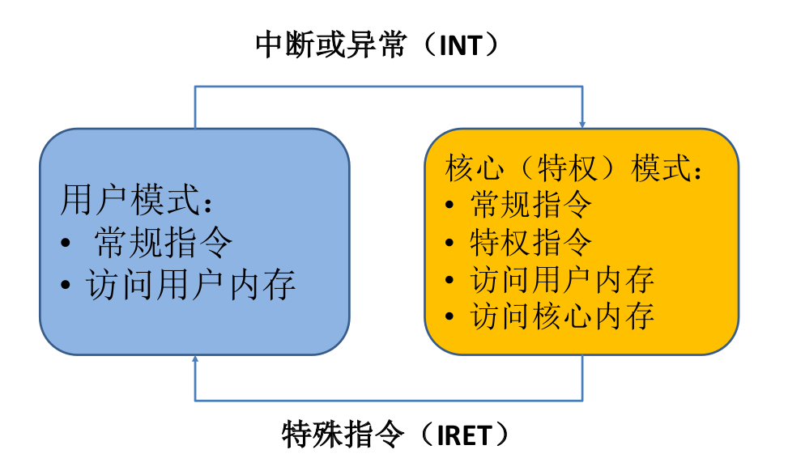

*X86 Protection Rings*

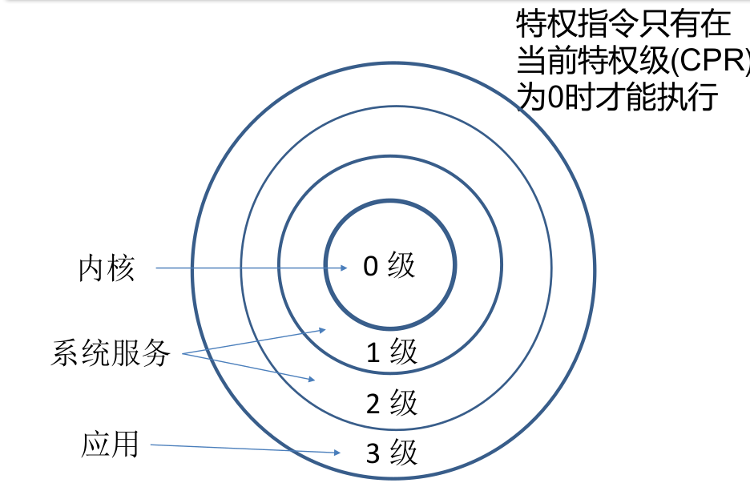


*2.层次结构*：不同层之间隐藏信息，层间存在依赖关系

- 优点：层功能独立
- 缺点：效率低、不灵活

*3.一体结构（宏内核）*

- 所以操作系统函数是一体的
- 系统调用接口
- 例子：Linux, BSD Unix, Windows
- 优点L：共享内核地址空间，性能高
- 缺点：不稳定，不灵活

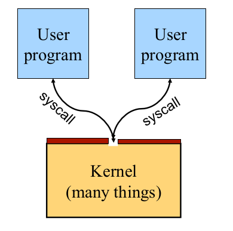

*4.微内核*

- 操作系统服务作为常规的进程
- 用户通过消息获取服务进程的服务
- 例子：Mach, L4, MacOS
- 优点：灵活，故障隔离
- 缺点：效率低（需要穿越多个边界），保护机制不完整，内核和服务不方便共享数据

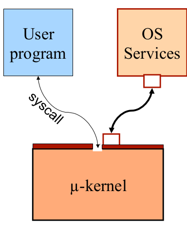

*5.库操作系统（LibOS)*

- 应用程序直接通过库与底层硬件交互
- 例子：ExoKernel, EXOS
- 优点：效率高
- 缺点：通用性差

*6.虚拟机*

- 虚拟机管理器：虚拟硬件，运行多个OS
- 例子：IBM VM/370, Java VM, Vmware, Xen

*两种实现VMM的例子*

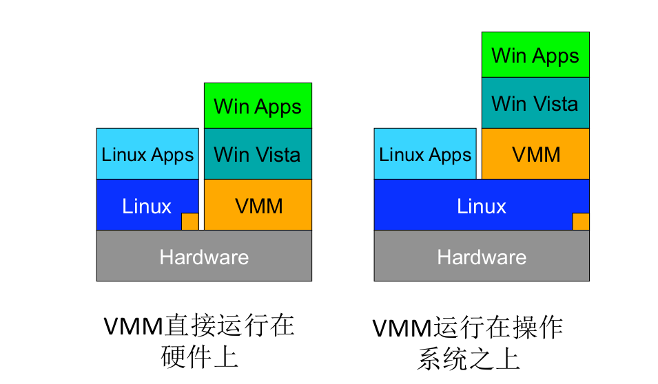

*OS状态切换*

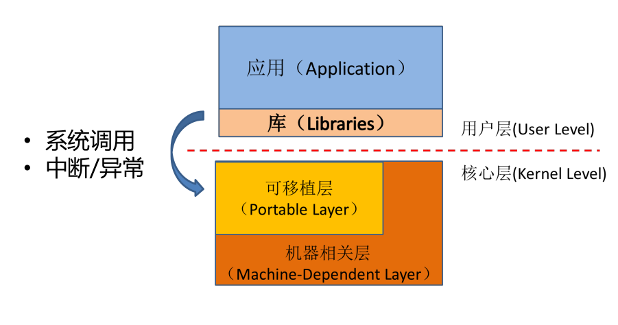

*7.系统调用机制*

- 假设：
  - 用户代码	是任意的
  - 用户无法修改核心内存
- 设计考虑：
  - 系统调用参数传递
  - 系统模式从用户态切换到核心态
  - 执行系统调用功能
  - 返回结果，切换到用户态

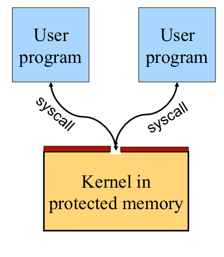

*8.中断与异常*

- 中断源：
  - 硬件（外部设备）
  - 软件 INT n
- 例外：
  - 程序错误：fault, trap, abort
  - 软件生成：INT 3
  - 硬件检查例外（machine check）

*9.系统调用*

- 操作系统的API：应用和操作系统之间的接口
- 种类：
  - 进程管理
  - 内存管理
  - 文件管理
  - 设备管理
  - 通信

*10.参数传递*

- 寄存器传参：
  - 寄存器个数
  - 可用寄存器个数
  - 系统调用参数个数
  - 编译器填充的代码
- 内存向量（数组）传参
  - 一个寄存器传递起始地址
  - 向量位于用户地址空间
- 堆栈传参
  - 类似内存向量
  - 遵循过程调用的约定

## Chapter02 进程和线程

### 进程

*1.进程的起源*

IBM 7090 机器上第一次实现了多个程序共同运行，"进程"开始登上历史舞台。

*2.进程的概念*

- 进程是指一个具有一定独立功能的程序在一个数据集合上的一次动态执行过程
- 进程刻画了一个程序运行所需要的资源
- 进程 VS 程序：
  - 进程 > 程序
    - 程序只是进程状态的一部分
    - 例子：多个用户可以运行相同的程序
  - 进程 < 程序
    - 一个程序可以创建多个进程
    - 例子：创建新进程

*3.并发性和进程*

- 并发性：
  - 一个系统中有上百个作业”同时“运行
  - CPU是共享的，I/O设备也是
  - 每一个作业都希望能拥有自己的计算机
- 进程并发性：
  - 将复杂的问题分解为多个简单的问题
  - 用进程来代表简单的问题
  - 一次只处理一个问题
  - 每一个进程就好像拥有了自己的计算机

*4.进程并发性*

- 虚拟化：
  - 每个进程运行一段时间
  - 使得一个CPU变成”多个“
  - 每一个进程就好像拥有了自己的CPU
- I/O并行性
  - CPU计算与I/O操作交叠
  - 每一个进程运行的很快，就如同拥有了自己的计算机
  - 减少了总共的完成时间
- CPU并行性
  - 多个CPU
  - 进程并行的运行
  - 加速

*5.最简单的进程*

- 顺序执行：
  - 在进程内部没有并发性
  - 一切都是顺序发生
  - 需要一些协调机制
- 进程状态：寄存器，内存，I/O设备（文件系统，通信端口）...

*6.进程的表示*

*进程在内核中的表示*

- 每个进程的创建和销毁都由内核负责，每个进程都需要在内核登记信息
- 内核用进程控制块（PCB）来保存进程的信息
- PCB是进程在内核中的表示，也是一种索引


*进程控制块包含的信息*

- 进程标识信息
- 与各种资源相关的信息：
  - CPU相关的进程管理信息：
    - 状态：
      - 就绪态：准备运行
      - 运行态：正在运行
      - 阻塞态：等待资源
    - 寄存器：EFLAGS，以及其他的CPU状态
  - 内存管理信息：
    - 栈、代码段和数据段
    - 段、页表、统计信息等
  - I/O和文件管理：通信端口、目录、文件描述符等

*7.进程的原语*

- **创建和终止**：Exec, Fork, Wait, Kill
- **信号**：动作，返回，信号处理函数
- **操作**：阻塞，放弃CPU控制权
- **同步**

*构造一个进程*

- 创建进程：创建与初始化PCB
  - 将数据和代码加载至内存
  - 创建一个空的调用栈
  - 初始化进程的状态
  - 把进程状态标志为就绪态
- 克隆：复制与修改PCB
  - 停止当前进程，并保存其状态
  - 备份当前代码、数据、栈和OS的状态
  - 把备份后的进程标志为就绪态


*8.进程的状态*

- 进程的声明周期：
  - 非抢占式内核：
    - 进程创建
    - 进程执行
    - 进程等待
    - 进程结束
  - 抢占式内核：
    - 进程创建
    - 进程执行
    - 进程等待
    - 进程抢占
    - 进程唤醒
    - 进程结束

*进程创建*：

何时创建进程？

- 系统初始化时
- 用户请求创建一个新进程
- 正在运行的进程执行了创建进程的系统调用

*进程执行*：

- 内核选择一个就绪的进程，为它分配一个处理器的时间片，并开始执行（时间片倒计时）

*进程等待*：

- 进程进入等待（阻塞）的情况：
  - 请求并等待系统服务，无法马上完成
  - 启动某种操作，无法马上完成
  - 需要的数据没有到达
- 只有进程自身才能知道何时需要等待某种事件的发生

*进程抢占*：

- 进程会被抢占的情况：
  - 高优先级进程就绪
  - 进程的时间片用完

*进程唤醒*：

- 唤醒进程的情况：
  - 被阻塞进程需要的资源可被满足
  - 被阻塞进程等待的事件到达
- 进程只能被别的进程或操作系统唤醒

*进程结束*：

- 进程结束的情况：
  - 正常退出（自愿的）
  - 错误退出（自愿的）
  - 致命错误（强制性的）
  - 被其他进程所杀（强制性的）

进程的状态转换图如下：


sleep()系统调用对应的进程状态变化：


*9.进程上下文切换*

- 保存上下文：所有寄存器，所有协同处理器的状态
- 开始新的上下文：相反的操作过程

### 线程

*1.线程的概念*

IBM System/360 引入线程

- 线程是进程的一部分，描述指令流执行状态，是CPU调度的基本单位
- 线程在同一进程的地址空间内，可共享变量

*2.线程与并发性*

- 线程：
  - 位于进程内部的一段顺序执行流
  - 位于进程内部的所有线程共享地址空间
- 线程并发性：
  - 相较信号，用线程更容易实现I/O交叠
  - 人们更愿意一次做多件事情：web服务器
  - 服务器服务多个请求
  - 多个CPU共享内存

*3.线程的表示*

线程控制块（TCB）：

- 状态：
  - 就绪态：准备运行
  - 运行态：正在运行
  - 阻塞态：等待资源
- 寄存器
- 程序计数器
- 栈
- 代码

*典型的线程API*：

- 创建：fork, join
- 互斥：acquire, release
- 条件变量：wait, signal, broadcast
- 警报：alert, alertwait, testalert

最简单的进程只有一个线程

*4.进程 VS 线程*

- 地址空间：
  - 进程之间一般不会共享内存
  - 进程切换会切换页表和其他内存机制
  - 进程中的线程共享整个地址空间
- 权限：
  - 进程拥有自己的权限，如文件访问权限
  - 进程中的线程共享所有的线程

*线程上下文切换*：

- 保存上下文：
  - 所有寄存器
  - 所有协同处理器的状态
- 开始新的上下文：相反的操作过程
- 可能触发进程的上下文切换

*过程调用*：

调用者或者被调用者保存部分上下文

*5.线程 VS 过程*

- 线程可能会乱序的恢复
  - 不能用栈保存状态
  - 每一个线程都有自己的栈
- 线程切换不会太频繁
  - 不会划分寄存器
  - 线程有“自己”的CPU
- 线程可以是异步的
  - 过程可以利用编译器异步地保存状态
  - 线程可以异步的运行
- 多线程
  - 多线程可以并行的在多个CPU上运行
  - 过程调用是线性的

*6.线程的分类*

- 用户线程：由一组用户级的线程库函数来完成线程的管理，包括线程的创建、终止、同步和调度等

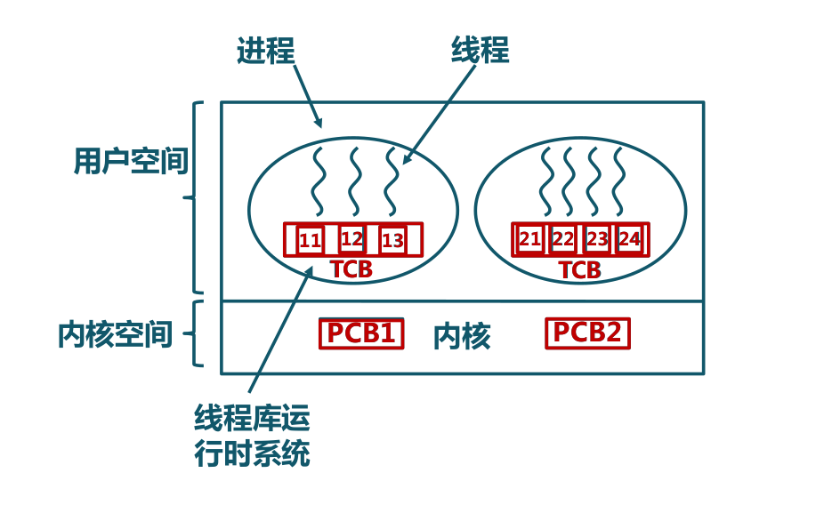

- 内核线程：由内核通过系统调用实现的线程机制，由内核完成线程的创建、终止和管理

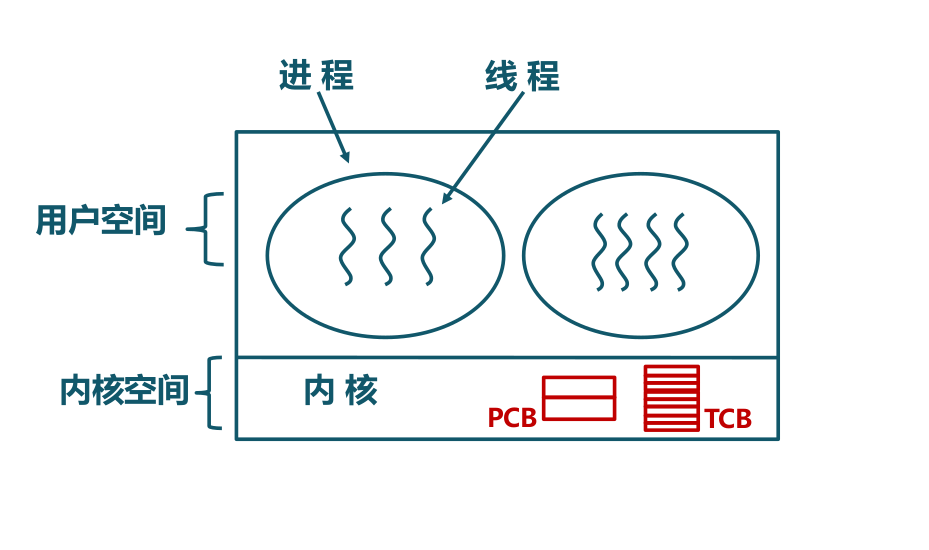

- 轻量级进程：内核支持的用户线程。一个进程可有一个或多个轻量级进程，每个轻权进程由一个单独的内核线程来支持

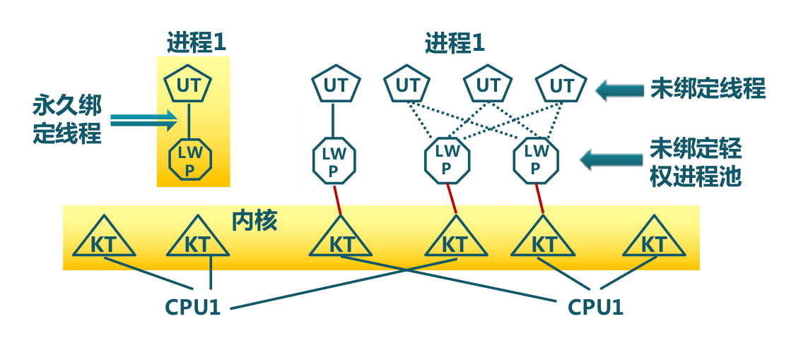

用户线程和内核线程的关系：

- 一对一：每一个用户级线程都拥有自己的内核栈
- 多对一：一个进程的所有线程共享同一个内核栈

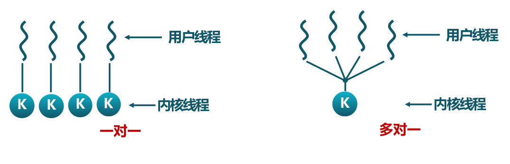

不同映射关系的对比：

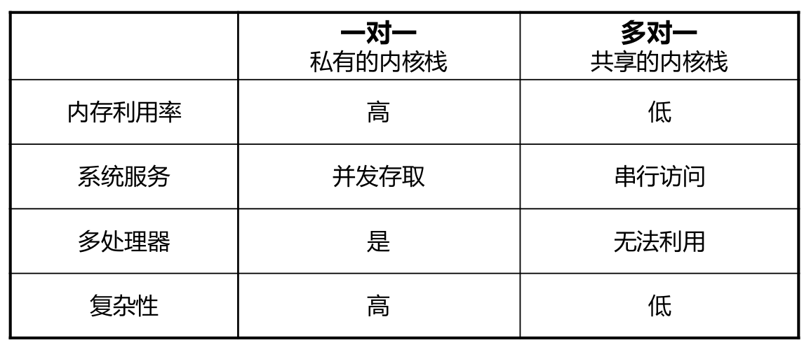

*总结*

- 进程：应用并发性的抽象
- 线程：应用内部并发性的抽象


### 非抢占式调度与抢占式调度


*7.非抢占式线程*	

*宏内核结构*：

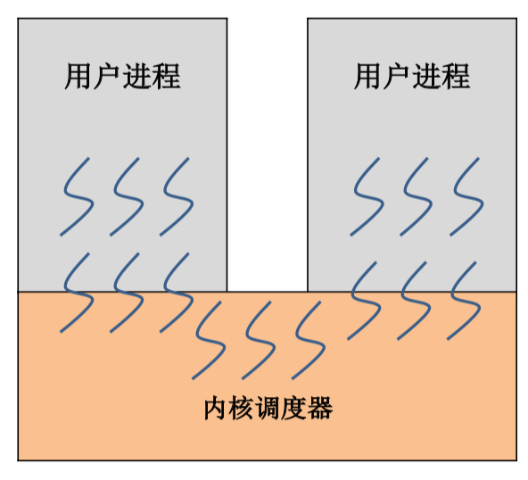

- 内核拥有自己的地址空间，并与所有的进程共享
- **内核包含**：
  - 引导加载程序
  - BIOS
  - 核心驱动
  - 线程
  - 调度器
- **调度器**：
  - 使用就绪队列来存放所有的就绪线程
  - 线程上下文切换在相同的地址空间进行调度
  - 进程上下文切换在新的地址空间进行调度

*非抢占式调度状态转换图*：

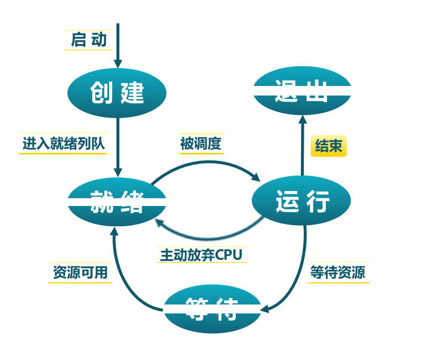

*非抢占式调度器*：

- 非抢占式调度器的启动：
  - `block()`
  - `yield()`
- 最简单的形式（调度器）：
  1. 保存当前进程/线程状态
  2. 选择下一个待运行的进程/线程
  3. 分派（加载并跳转到相应PCB/TCB）

*保存线程上下文*：

- 在线程的栈上保存上下文：
  - 许多处理器有专门的指令来高效的保存上下文
  - 但是，需要处理溢出的问题
- 保存前需要检查：
  - 确保栈上没有溢出的问题
  - 把上下文保存到TCB中
  - 效率不是很高，但是没有溢出的问题

*8.抢占式线程*

通过中断进行抢占

- 为什么要抢占：
  - 利用时钟中断进行CPU管理
  - 异步I/O和计算交叠在一起
- 中断：
  - 发生在指令之间
  - 发生在一条指令执行期间（非原子指令）
- 操纵中断
  - 关闭中断
  - 开启中断
  - Non-Masking Interrupts (NMI)

*抢占式调度的状态转换图*：

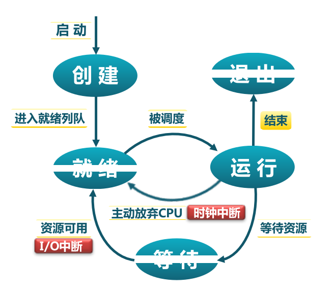

*抢占式调度的中断处理*：

- I/O中断处理：
  1. 保存当前进程/线程到它们的PCB/TCB
  2. 进行I/O
  3. 调用调度器
- 时间中断处理：
  1. 保存当前进程/线程到它们的PCB/TCB
  2. 关中断，增加计数器，检查当前状态是否处于用户态，如果是，则首先进入内核，然后进行中断处理，否则（处于内核态），直接返回（内核态不能被中断）
  3. 调用调度器
- 问题：
  - 打开/关闭中断
  - 确保在多处理器环境下也可以工作

*抢占式调度面临的问题*：

- 问题： 中断随时随地都可能发生
- 简单方法：时刻关注是否发生中断或抢占
- 目标：
  - 不要时刻关注抢占和中断
  - 底层行为被封装在“原语”中
  - 同步“原语“关注抢占
  - OS和应用使用同步原语

*9.用户线程 VS 内核线程*

- 用户级线程：
  - 用户级线程库实现线程上下文切换
  - 时间中断会引入抢占
  - 当用户级线程被I/O阻塞时，整个进程都会被阻塞
- 内核级线程：
  - 内核级线程被内核调度器调度
  - 由于跨域了保护边界，内核级线程的上下文切换开销远大于用户级线程
- 混合：有可能实现一个混合的调度器，但是会很复杂

*总结*：

- 非抢占式线程：
  - 调度器
  - 上下文保存的位置
- 抢占式线程：
  - 中断随时都可能发生
- 用户线程 VS 内核线程：
  - 主要的区别是所选择的调度器


### CPU调度

*1.调度器工作*：

- 保存当前进程/线程状态（PCB/TCB）
- 选择下一个待运行的进程/线程
- 分派（加载并跳转到相应PCB/TCB）

*2.何时调度？*

- 进程/线程创建
- 进程/线程退出
- I/O阻塞、同步
- I/O中断
- 时间中断

*3.调度准则*

- 假设：
  - 一个用户运行一个程序，一个程序创建一个线程
  - 程序之间是独立的
- 批处理和实时交互系统设计目标：
  - 保证公平性
  - 每个作业都有机会运行，没有人会“饥饿”
  - 最大化CPU资源利用率
  - 最大化吞吐率：最小化开销，最大化资源利用率
  - 最小化周转时间
    - 批处理作业：执行时间（从提交到完成）
  - 缩短响应时间
    - 交互式作业：响应时间
  - 均衡性：满足用户需求

*4.先到先服务（FCFS）算法*

- 一直运行到结束（过去）
- 一直运行到阻塞或主动放弃CPU
- 用于非抢占式调度

优点：

- 实现简单

缺点：

- 平均响应时间波动大
- I/O资源和CPU资源的利用率较低

*5.最短时间优先（STCF)*

- 非抢占式调度

*6.最短剩余时间优先（SRTCF)*

- 选择就绪队列中剩余时间最短进程占用CPU进入运行状态
- 就绪队列按剩余时间来排序

优点：

- 平均响应时间短

缺点：

- 可能会造成饥饿：连续的短进程流会使长进程无法获得CPU资源
- 需要预知未来

*7.时间片轮转算法（RR）*

- 和FCFS算法类似，但是增加了时间片
- 时间片结束时，调度器按FCFS算法切换到下一个就绪进程
- 轮转调度是抢占式调度

*时间片长度选择*：

- 大时间片：
  - 等待时间过长
  - 极端情况下退化为FCFS
- 小时间片：
  - 响应时间快
  - 产生大量上下文切换，影像系统吞吐
- 经验规则：选择一个合适的时间片，使上下文切换开销处于1%以内

*8.虚拟轮转算法（VRR）*

- 引入辅助队列FIFO（先入先出）
- I/O密集型进程会进入辅助队列而不是就绪队列以备调度
- 引入优先级：辅助队列比就绪队列有更高的优先级

*9.多级队列（MQ）与优先级*

- 将就绪队列分为多个独立的子队列，每个队列可有自己的调度算法：前台RR，后台FCFS
- 队列之间
  - 每个队列分配一个优先级和相应时间片
  - 队列间按照时间片调度

*10.多级反馈队列（MLFQ）算法*

- 进程可在不同队列中移动的多级队列算法
- 特征：
  - 时间片大小由优先级级别增加而增加
  - 进程在当前的时间片没有完成，则降到下一个优先级
  - CPU密集型进程的优先级下降很快，I/O密集型进程停留在高优先级

*11.彩票调度*

- 动机：SRTCF可以保证平均响应延迟，但是不公平
- 彩票方法：
  - 给每个作业一定数量的彩票
  - 随机抽取一张中奖彩票（运行相应进程）
  - 为了近似SRTCF，给短作业更多的彩票
  - 为了避免“饥饿”，给每个作业至少一张彩票
  - 相互合作的进程可以交换彩票

*12.公平共享调度（FSS）*

- FSS控制用户对系统资源的访问
  - 一些用户组比其他用户组更重要
  - 保证不重要的组无法垄断资源
  - 未使用的资源按比例分配
  - 没有达到资源使用率目标的组获得更高的优先级

*13.调度算法总结*

- 先到先服务调度算法：不公平，平均响应时间差
- 最短时间优先调度算法：
  - 不公平，平均响应时间短
  - 需要预测未来
  - 可能导致饥饿
- 时间片轮转调度算法：公平，平均响应时间较差
- 虚拟轮转算法：公平，平均响应时间短
- 多级反馈队列算法：集成多种调度算法
- 彩票调度算法：公平，平均响应时间好
- 公平共享调度算法：公平第一位

*14.多处理器/集群调度*

- 设计	问题：进程/线程到处理器分配
- 协同调度：
  - 一个进程的多个线程共同运行
  - 一个应用的多个进程共同运行
- 专用的处理器分配：线程会在一个专用的处理器上运行直到完成

*15.实时调度*

- 两种类似的实时：

  - 硬实时：必须满足，否则会导致错误
  - 软实时：大多时候满足，没有强制性

- 接纳控制：

  - 只有当系统能够保证所有进程的实时性的前提下，新的实时进程才会被接纳
  - 如果满足下面的条件，作业就是可调度的：

  $$\sum\frac{C_I}{T_i} \le 1$$，其中，$C_i=$计算时间，$T_i=$周期

*16.速率单调调度*

- 假设：
  - 每个进程必须在其周期内完成
  - 进程之间没有依赖关系
  - 每个进程在每个周期内需要的CPU时间相同
  - 非周期性进程没有截止日期
  - 进程抢占瞬间发生（没有开销）
- 基本思想：
  - 给每个进程分配一个固定的优先级=出现频率
  - 运行最高优先级的进程
  - 证明是最优的


*17.最早最终时速优先调度（EDS）*

- 假设：
  - 当进程需要CPU时间时，它会宣布其最终时限
  - 不一定是周期性进程
  - 需要的CPU时间可以变化
- EDS的基本思想：
  - 根据最终时限对就绪的进程进行排序
  - 运行列表中的第一个进程（最早最终时限优先）
  - 当新的进程就绪时，并且其最终时限快来临时，它会抢占当前进程

*18.BSD多队列调度*

- “一秒钟”抢占：进程如果在一秒内没有阻塞或者完成，就会被抢占
- 优先级每秒重新计算

*19.Linux中的调度*

- 分时共享调度：
  - 每个进程都会有优先级和Credits
  - I/O事件会提升优先级
  - 拥有最多Credits的进程会优先运行
  - 时间中断会减少进程的Credits
  - 如果所有进程的Credits都耗尽了，内核会重新给进程分配：Credits = Credits / 2 + Priority
- 实时调度：
  - 软实时
  - 内核不会被用户代码抢占

*20.Windows中的调度*

- 分类和优先级
- 优先级驱动的调度器
- 多处理器调度

### 调度前沿扩展

*NUMA调度*

*分布式调度*

*虚拟机调度*

## Chapter03 同步与通信

### 临界区与原子操作

*1.同步与通信的概念*

通信的两大作用：

- 并发进程/线程之间需要进行信息同步和数据传输
- 信息同步：
  - 保障多进程/多线程正确的使用共享资源
  - 共享资源可以是：
    - 一个变量
    - 一块缓冲区
    - 一个文件
    - 一个设备等
- 数据传输：
  - 便于将单个任务切分、模块化提高并发度

*2.临界区*

- 临界区：进程中访问临界资源的一段需要互斥执行的代码
- 进入临界区：
  - 检查可否进入临界区的一段代码
  - 如可进入，设置相应“正在访问临界区”的标志
- 退出临界区：清除“正在访问临界区”标志

*3.原子操作*

- 原子操作是指一次不存在任何中断或失败的操作
  - 要么操作成功完成
  - 或者操作没有执行
  - 不会出现部分执行的状态
- 对临界区的操作必须是原子操作
- 操作系统需要利用同步机制在并发执行的同时，保证一些操作是原子操作

*同步机制设计*

1. 识别出共享资源与使用者
2. 设计合适的同步机制
3. 验证临界区是否符合原子操作

*4.临界区的保障*

- 基于软件
- 硬件中断
- 原子操作指令与互斥锁


*基于软件的方法*

- 线程可通过共享一些共有变量来同步它们的行为

- *Peterson*算法：满足线程Ti和Tj之间互斥的经典的基于软件的解决办法：

  - 共享变量：

    ```c
    int turn;//表示该谁进入临界区
    bool flag[];//表示进程是否准备好进入临界区
    ```

  - 进入区代码：

    ```c
    flag[i] = true;
    turn = j;
    while(flag[j] && turn = j)
    ```

  - 退出区代码：

    ```c
    flag[i] = false;
    ```

- *Dekkers*算法

- 缺点：

  - 复杂：需要两个进程/线程之间的共享数据项
  - 需要“忙等待”：浪费CPU时间

*禁用中断实现互斥*

- 使用中断：
  - 实现抢占式CPU调度
  - 通过在acquire和release之间禁止上下文切换来提供互斥
  - 两种类型的事件能引起切换：
    - 内部事件：放弃CPU控制权
    - 外部事件：使得CPU重新调度
- 禁用中断以屏蔽外部事件：
  - 引入不可中断的代码区域
  - 大多数时候用串行思维
  - 延迟处理外部事件
- 缺点：
  - 禁用中断后，进程无法被停止：
    - 整个系统都会为此停下来
    - 可能导致其他进程处于“饥饿”状态
  - 临界区可能很长：无法确定响应中断所需要的时间（可能存在硬件影响）

*原子操作指令*

- 现代CPU都提供一些特殊的原子操作指令

- 测试和置位（TAS/TS）指令：

  - 从内存单元中读取值

  - 测试该值是否为1，然后返回真或假

  - 内存单元值设置为1

    ```c
    bool TestAndSet(bool *Target){
        bool rv = *Target;
        *Target = true;
        return rv;
    }
    ```

- 交换指令：

  - 交换寄存器与内存：

    ```c
    void Exchange(bool *a, bool *b){
        bool tmp = *a;
        *a = *b;
        *b = tmp;
    }
    ```

- Fetch-and-Add或Fetch-and-Op：

  - 用于大型共享内存多处理器系统的原子指令

- Load Linked 和Conditional Store（LL - SC）：

  - 在一条指令中读一个值（LL）
  - 做一些操作
  - Store时，检查LL之后，值是否被修改过。如果没有，则OK，否则，从头再来

*使用TAS指令实现锁*

- 忙等待：

```cpp
class Lock{
    int value = 0;
}
Lock::Acquire(){
    //如果锁被释放，TAS读取0并将值设置为1：锁被设置为忙并且需要等待完成
    //如果锁处于忙状态，TAS指令读取1并将值设置为1：不改变锁的状态并且需要循环
    //返回值为之前的值
    while (test-and-set(value))
        ;
}
Lock::Release(){
    value = 0;
}
```

- 无忙等待：

```cpp
class Lock{
    int value = 0;
    WaitQueue q;
}
Lock::Acquire(){
    while (test-and-set(value)){
        add this TCB to wait queue q;
        schedule();
    }
}
Lock::Release(){
    value = 0;
    remove one thread t from q;
    wakeup(t);
}
```

- 优点：
  - 适用于单处理器或者共享主存的多处理器中任意数量的进程同步
  - 简单并且容易证明
  - 支持多临界区
- 缺点：
  - 忙等待消耗处理器时间
  - 可能导致饥饿：进程离开临界区时有多个等待进程的情况
  - 死锁：
    - 拥有临界区的低优先级进程
    - 请求访问临界区的高优先级进程获得处理器并等待临界区

*总结*

- 软件方法：实现复杂
- 中断：
  - 有很多问题
  - 实现之后，只能用于单核处理器
- 原子操作指令与锁：
  - 大多数时间在用户层自旋
  - 线程数比处理器数目多


### 死锁

*1.一些定义*

- 进程和线程等价
- 资源：
  - 可抢占：CPU（可以被夺取）
  - 不可抢占：磁盘，文件，互斥锁...
- 使用资源：请求，使用，释放
- 饥饿：进程无限等待
- 死锁：如果一个进程集合中所有进程都在等待一个事件，且等待的事件只能由集合中其他进程触发，则称该进程集合死锁

*2.死锁发生的条件*

- 互斥：
  - 所有资源都被分配给恰好一个进程
- 占有和等待：
  - 持有资源的进程可以请求新的资源
- 不可抢占：
  - 资源不可被夺走
- 环路等待：
  - 进程以环路的方式进行等待

*3.策略*

- 忽略问题：是用户的错
- 检查并恢复：事后修复问题
- 动态避免：小心的分配资源
- 预防：破坏四个条件中的一个

*4.忽略问题：鸵鸟算法*

- 操作系统内核死锁：
  - 重启
- 设备驱动死锁：
  - 卸载设备
  - 重启
- 应用程序挂起：
  - 杀死并重启程序
- 应用程序运行一段时候后挂起：
  - 给程序设定一个checkpoint
  - 改变运行环境（重启操作系统）
  - 从上一个checkpoint重新开始

*5.检测和恢复*

- 检测：
  - 扫描资源分配图
  - 发现圈
- 恢复（很困难）
  - 杀死进程/线程
  - 回滚死锁线程的操作

*6.避免*

- 安全状态：
  - 未发生死锁
  - 存在一个调度方案，使得所有进程能够完成（即使所有进程同时请求最大资源）
- 银行家算法：
  - 单个资源：
    - 每个进程有一个贷款额度
    - 总的资源可能不能满足所有的贷款额度
    - 跟踪分配的和仍然需要的资源
    - 每次分配时检查安全性
  - 多个资源：
    - 两个矩阵：已分配和仍然需要

*7.银行家算法*

- 数据结构：
  - n: 线程数量，m: 资源类型数量
  - Available（剩余空闲量）：长度为 m 的向量
    - 当前有Available[j]个类型Rj的资源实例可用
  - Allocation（已分配量）: n x m 矩阵
    - 线程 Ti 当前分配了 Allocation[i, j] 个 Rj 的实例 
  - Need（未来需要量）：n x m 矩阵
    - 线程 Ti 未来需要 Need[i, j] 个 Rj 资源实例
  - Need[i, j] = Max[i, j] - Allocation[i, j]

- 算法描述：

  - 初始化：

    - Ri 是线程 Ti 的资源请求向量
    - Ri[j] 是线程 Ti 请求 Rj 的实例

  - 循环：依次处理线程 Ti, i = 1, 2, 3, ...

    1. 如果 Ri <= Need[i] ，转到 2，否则，拒绝资源申请，因为线程已经超过了其最大要求

    2. 如果 Ri <= Available ，转到 3，否则，Ti 必须等待，因为资源不可用

    3. 通过安全状态判断来确定是否分配资源给 Ti ：

       - 首先生成一个需要判断状态是否安全的资源分配环境：

         ```c
         Available = Available - Ri;
         Allocation[i] = Allocation[i] + Ri;
         Need[i] = Need[i] - Ri;
         ```

       - 调用安全状态判断：如果返回是安全，将资源分配给 Ti，如果返回结果是不安全，系统会拒绝 Ti 的资源请求

*8.预防*

- 避免互斥：
  - 有些资源物理上不可共享：打印机，磁带等
  - 有些可设计成共享：只读文件，内存等，读写锁
  - 有些可以通过假脱机进行虚拟化：
    - 使用存储，将一个资源虚拟化成多个资源
    - 使用队列进行调度

- 避免占有和等待：
  - 两阶段加锁：
    - 阶段 I：试图对所有所需的资源加锁
    - 阶段 II：如果成功，使用资源，然后释放资源；否则，释放所有的资源，并从头开始
  - 应用：电信公司的电路交换

- 允许抢占：
  - 使调度器了解资源分配情况
  - 方法：
    - 如果系统无法满足一个已占有资源的进程的请求，抢占该进程并释放所有的资源
    - 只在系统能满足所有资源时进行调度
  - 其他方法：抢占占有被请求的资源的进程

- 避免环路等待：
  - 对所有资源制定请求顺序
  - 方法：
    - 对每个资源分配唯一的 id
    - 所有请求必须按 id 升序提出
  - 变种：
    - 对每个资源分配唯一的 id
    - 进程不能请求比当前所占有的资源编号低的资源


*9.权衡和应用*

- 对应用程序忽略问题：
  - 处理死锁是应用开发者的问题
  - OS 提供打破应用程序死锁的机制


  - 内核不应该出现死锁：
    - 使用预防方法
    - 最流行的做法是在所有地方使用避免环路等待原则


### 信号量、管程与条件变量

*1.信号量*

- 信号量是操作系统提供的一种协调共享资源访问的方法

- 信号量的组成：

  - 一个整形变量：表示系统资源的数量

  - 两个原子操作：

    - P 操作（又称 Down 或 Wait）：等待信号量为正，然后将信号量减一

      ```c
      P(s){
          while(s <= 0){
              ;
          }
          --s;
      }
      ```

    - V 操作（又称 Up 或 Signal）：将信号量加一

      ```c
      V(s){
          ++s;
      }
      ```

- 信号量的实现：

  ```c++
  class Semaphore{
      int sem;
      WaitQueue q;
  };
  Semaphore::P(){
      --sem;
      if (sem < 0){
          Add this thread t to q;
          block(p);
      }
  }
  Semphore::V(){
      ++sem;
      if (sem <= 0){
          Remove one thread t from q;
          wakeup(t);
      }
  }
  ```

- 信号量的使用：

  - 互斥访问：保护临界区互斥访问，`Semaphore(1)`
  - 条件同步：多线程之间同步，`Semaphore(N >= 0)`

*用信号量实现有限缓冲区*

- 问题描述：

  - 一个或多个生产者在生成数据后放在一个缓冲区里
  - 单个消费者从缓冲区中取出数据处理
  - 任何时刻只能有一个生产者或消费者可访问缓冲区

- 问题分析：

  - 互斥访问：任何时候只能有一个线程操作缓冲区
  - 条件同步：缓冲区空时，消费者必须等待生产者；缓冲区满时，生产者必须等待消费者

- 实现：

  ```c++
  class BoundedBuffer{
      mutex = new Semaphore(1);
      fullBuffers = new Semaphore(0);
      emptyBuffers = new Semaphore(n);
  };
  BoundedBuffer::Deposit(c){
      emptyBuffers->P();
      mutex->P();
      Add c to the buffer;
      mutex->V();
      fullBuffers->V();
  }
  BoundedBuffer::Remove(c){
      fullBuffers->P();
      mutex->P();
      Remove c from buffer;
      mutex->V();
      emptyBuffers->V();
  }
  ```

*2.管程*

- 管程是一种用于多线程互斥访问共享资源的程序结构
  - 采用面向对象方法，简化了线程间的同步控制
  - 任意时刻最多只有一个线程执行管程代码
  - 正在管程中的线程可临时放弃管程的互斥访问，等待事件出现时恢复
- 管程的组成：
  - 一个锁：控制管程代码的互斥访问
  - 0 个或多个条件变量：管理共享数据的并发访问

*条件变量*

- 条件变量是管程内的等待机制，每个条件变量表示一种等待原因，对应一个等待队列

- `Wait()`操作：

  - 将自己阻塞在等待队列中
  - 唤醒一个等待者或释放管程中的互斥访问

- `Signal()`操作：

  - 将等待队列中的一个线程唤醒
  - 如果等待队列为空，则等同空操作

- 条件变量额实现：

  ```c++
  class Condition{
      int numWaiting = 0;
      WaitQueue q;
  };
  Condition::Wait(Lock){
      ++numWaiting;
      Add this thread t to q;
      release(Lock);
      schedule();
      acquire(Lock);
  }
  Condition::Signal(){
      if (numWaiting > 0){
          Remove one thread t from q;
          wakeup(t);
          --numWaiting;
      }
  }
  ```

*用管程实现生产者-消费者问题*

```c++
class BoundedBuffer{
    Lock lock;
    int count = 0;
    Condition notFull, notEmpty;
};
BoundedBuffer::Deposit(c){
    lock->Acquire();
    while (count == n){
        notFull.Wait(&lock);
    }
    Add c to the buffer;
    ++count;
    notEmpty.Signal();
    lock->Release();
}
BoundedBuffer::Remove(c){
    lock->Acquire();
    while (count == 0){
        notEmpty.Wait();
    }
    Remove c from buffer;
    --count;
    notFull.Signal();
    lock->Release();
}
```

*Signal之后的选择*

- 让被唤醒的线程立刻执行，并挂起发送方（Hoare)
  - 如果发送方有其他工作要做，会很麻烦
  - 很难确定没有其他工作要做，因为 Signal 的实现并不知道它是如何被使用的
- 退出管程（Hansen)：Signal 必须是管程中的过程的最后一个语句
- 继续执行(Mesa)
  - 易于实现
  - 然后，被唤醒的进程实际执行时，条件可能不为真

*3.Mesa风格管程*

- 将条件变量与一个互斥量关联
- `Wait(mutex, condition)`：
  - 原子解锁 mutex，并加入 condition 对应的队列（阻塞该线程）
  - 被唤醒时，重新锁定（mutex）
- `Signal(condition)`：
  - 当没有线程阻塞于该条件变量时，什么也不做
  - 如果有被阻塞的线程，唤醒至少一个
- `Broadcast`：唤醒所有等待的线程

*4.屏障原语*

- 功能：
  - 指定一个屏障变量
  - 广播给其他 n - 1 个线程
  - 若屏障变量的值达到 n，则继续
- 在某些并行计算机上，有硬件支持：
  - 多播网络
  - 计数逻辑
  - 用户级屏障变量

*5.等价性*

- 信号量：
  - 适合发送信号
  - 不适合实现 mutex，因为容易引入 bug
- 管程：
  - 适合调度和 mutex
  - 用作发送信号时，开销可能会比较大

*操作系统提供的同步机制总结*

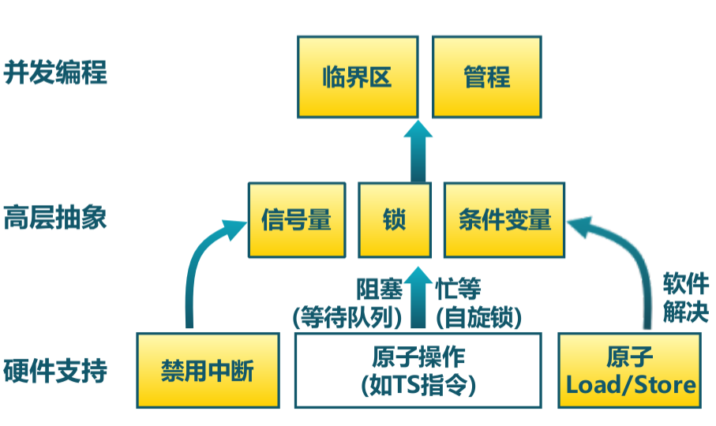

### 进程间通信

*1.基本概念*

- 进程间通信（IPC, Inter-Process Communication）
- 不同进程间进行通信和同步的机制
- 两个原语：
  - Send(message)
  - Receive(message)
- 进程通信流程：
  - 建立通信链路
  - Send/Recv交换数据

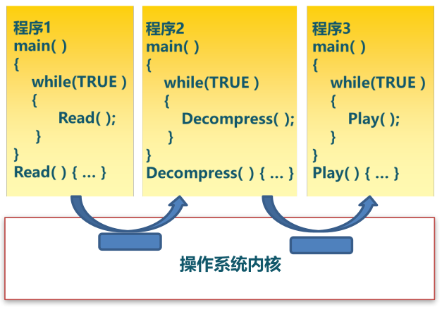

*2.消息队列*

- 消息队列是由操作系统维护的以字节序列为基本单位的间接通信机制
- 每个消息（Message）是一个字节序列
- 相同标识的消息按照先进先出顺序组成一个消息队列

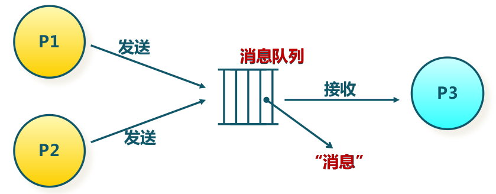

- 消息队列的系统调用：
  - `msgget(key, flags)` ：获取消息队列标识
  - `msgsnd(QID, buf, size, flags)`：发送消息
  - `msgrcv(QID, buf, size, type, flags)`：接收消息
  - `msgctl(...)`：消息队列控制

*3.共享内存*

- 共享内存是操作系统把同一个物理区域同时映射到多个进程的内存地址空间的通信机制
- 每个进程将共享内存区域映射到私有地址空间
- 优点：快速、方便的共享数据
- 缺点：必须用额外的同步机制来协调数据访问

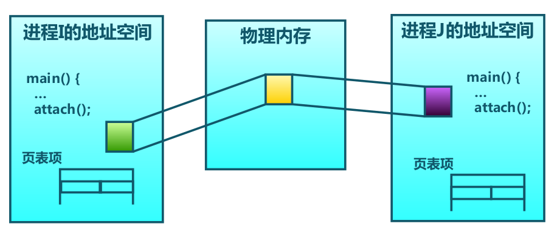

- 共享内存系统调用：
  - `shmget(key, size, flags)`：创建共享段
  - `shmat(shmid, *shmaddr, flags)`：把共享段映射到进程地址空间
  - `shmdt(*shmaddr)`：取消共享段到进程地址空间的映射
  - `shmctl(...)`：共享段控制
- 需要信号量等机制协调共享内存的访问冲突

*4.管道*

- 进程间基于内存文件的通信机制
  - 子进程从父进程继承文件描述符
  - 默认文件描述符：0 为stdin，1为stdout，2为stderr
- 进程不知道的另一端
  - 可能从键盘，文件，程序读取
  - 可能写入到终端，文件，程序

*管道示例*

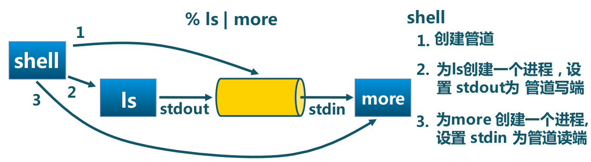

- 与管道相关的系统调用：
  - 读管道：`read(fd, buffer, nbytes)`
    - C语言中的scanf()是基于它实现的
  - 写管道：`write(fd, buffer, nbytes)`
    - C语言中的printf()是基于它实现的
  - 创建管道：`pipe(rgfd)`
    - rgfd 是 2 个文件描述符组成的数组
    - rgfd[0] 是读文件描述符
    - rgfd[1] 是写文件描述符

*5.信号*

- 进程间的软件中断通知和处理机制，如 SIGKILL, SIGSTOP, SIGCONT等
- 信号的接收处理：
  - 捕获：执行进程指定的信号处理函数被调用
  - 忽略：执行操作系统指定的缺省处理，例如进程终止，进程挂起等
  - 屏蔽：禁止进程接收和处理信号（可能是暂时的）
- 不足：传递的信息量少，只有一个信号类型
- 信号的实现：


*6.缓冲消息*

- 无缓存：
  - 发送方必须等待接收方接收消息
  - 每个消息都要握手
- 有界缓冲：
  - 缓冲区长度有限
  - 缓冲区满则发送阻塞
  - 使用一个管程
- 无界缓冲：
  - “无限”长度
  - 发送方永远不阻塞

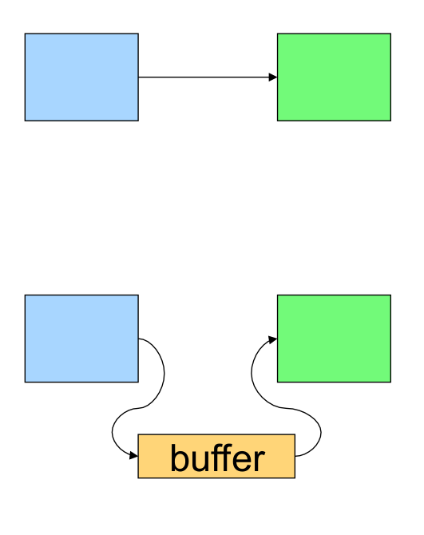

*7.直接通信*

- 只有接收端有缓冲：
  - 多个进程可能向接收方发送消息
  - 从特定的进程接收消息需要遍历整个缓冲区

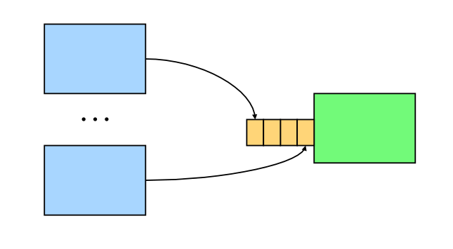

- 每个发送者有一个缓冲区：
  - 每个发送者发送给多个接收者
  - 获取消息仍需要遍历缓冲区

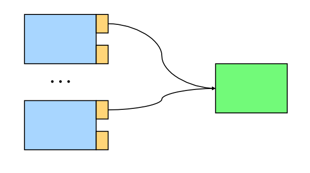

*8.间接通信*

- 使用信箱：
  - 允许多对多通信
  - 需要打开/关闭信箱
- 缓冲：在信箱需要有一个缓冲区以及互斥锁和条件变量
- 消息长度：不确定，可以把大消息切成多个包
- 信箱和管道对比：
  - 信箱允许多对多通信
  - 管道隐含一个发送一个接收

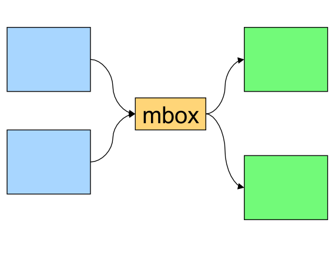

*9.同步和异步*

- 同步：
  - 发送：
    - 如果资源忙则阻塞
    - 启动数据传输
    - 直到源缓冲用完后在阻塞
  - 接收：如果有消息则返回数据
- 异步：
  - 发送：
    - 如果资源忙则阻塞
    - 启动数据传输并且立即返回
    - 结束：
      - 需要应用检查状态
      - 通知或者向应用发信号
  - 接收：
    - 如果有消息则返回数据
    - 如果无消息则返回状态

*10.例外*

- 进程结束：
  - R等待S发来的消息但S已经结束：R会永久阻塞
  - S发送了一个消息给R，但R已经结束：S没有缓冲，永久阻塞
- 消息丢失：
  - 使用确认（ack）和超时检测（timeout）和重传消息：
    - 需要接收者每收到一个消息发送一个确认
    - 发送者阻塞知道ack到达或者超时
    - status = send(dest, msg, timeout)
    - 如果超时发生且没收到确认，重发消息
  - 问题：
    - 重复
    - 丢失确认消息
  - 重传必须处理：
    - 在接收端消息重复
    - 发送端确认乱序
  - 重传：
    - 使用序列号确认是否重复
    - 在接收端删掉重复消息
    - 发送端收到乱序确认时重传
  - 减少确认消息：
    - 批量传送确认
    - 接收者发送no ack

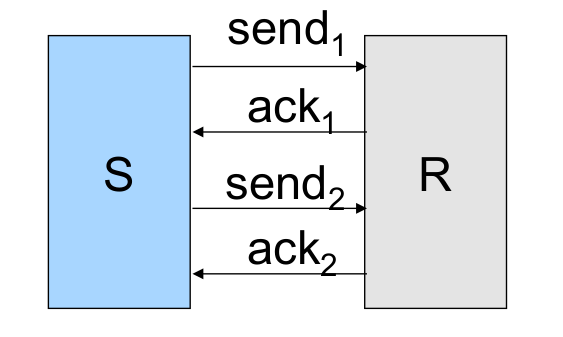

- 消息损坏：
  - 检测：
    - 发送端计算整个消息的校验并随消息发送校验和
    - 在接收端重新计算校验和并和消息中的校验和对比
  - 纠正：
    - 重传
    - 使用纠错码恢复

## Chapter04 虚存管理

### 虚存和地址转换

*1.现有计算机体系结构*

- 冯诺依曼结构
- 层次化存储结构
- 内存DRAM：快，但贵，容量小，易失性
- 外存磁盘：持久化，便宜，容量大，但慢

*2.最简单的系统*

- 只有物理内存：应用程序直接使用物理内存
- 物理内存静态划分

*3.进程保护*

- 一个进程出错不能影响其他进程
- 对每次内存访问都进行检查，只允许合法的内存访问

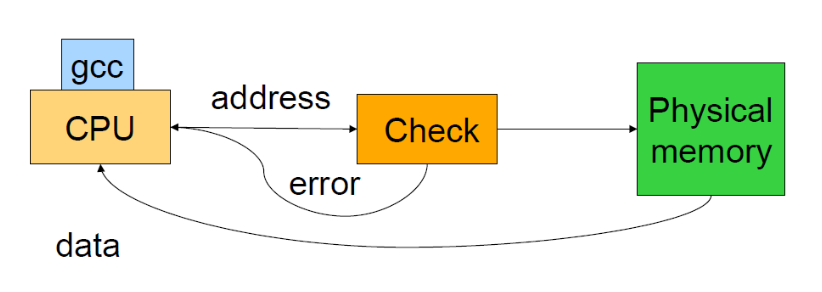

*4.扩展内存和应用透明*

- 一个进程必须能运行在不同的物理内存区域上
- 一个进程必须能运行在不同的物理内存大小上

*5.问题*

- 如何高效使用内存空间？
  - 同时运行多个进程：系统运行的进程越多越好
  - 保护：
    - 一个用户进程不能读取，更不能修改另一个用户进程的内存
    - 用户进程不能破坏内核的内存
- 基本内存抽象：
  - 地址空间：进程的内存视图 -> 虚拟视图
  - 透明、高效、安全保护

*6.虚拟内存*

- 独立的进程地址空间：
  - 给每个进程一个很大的、静态的虚拟地址空间
- 虚实地址转换/映射：
  - 当一个进程运行时，每次访存通过地址转换获得实际的物理内存地址
- 磁盘作为内存的延展（磁盘交换区）
  - 只装载部分地址空间至内存

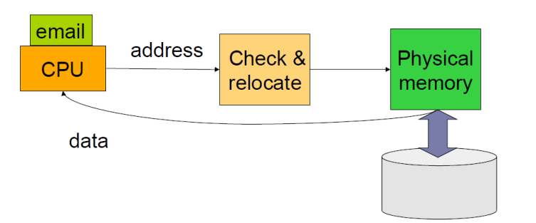

*地址空间*

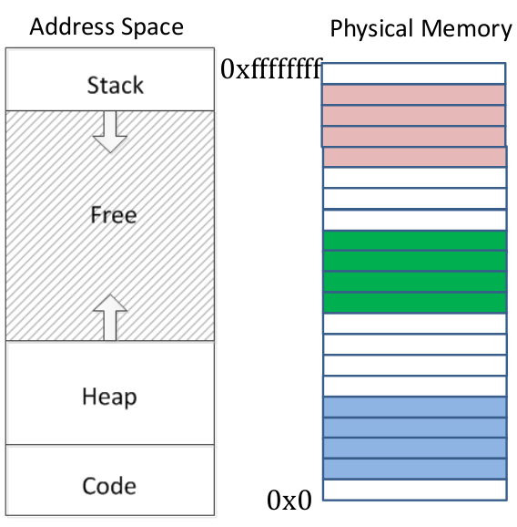

- 独立的进程地址空间：[0, max - 1]，程序员看到的是虚地址
- 运行时装载部分地址空间
- 每次访存：虚地址 -> 物理地址
  - CPU看到的是虚地址
  - 进程看到的是虚地址
  - 内存与 I/O 设备看到的是物理地址
- 如果访问到未装载的地址空间：通知OS将它加载进内存空间

*虚存的好处*

- 灵活：进程在执行时才放进内存，一部分在内存，另一部分在磁盘
- 简单：进程的内存访问变得非常简单
- 高效：
  - 20/80原则：20%的内存承担80%的访问
  - 将20%放进物理内存

*7.地址映射*

- 目标：
  - 隐式：对于每个内存访问，转换是隐式的
  - 快速：命中内存时，必须非常快
  -  例外：不命中时触发一个例外
  - 保护：对用户进程的错误进行保护

*基址 + 长度*：（Cray-1 采用的方法）

- 连续分配：
  - 为每个进程分配地址连续的内存
  - 用一个二元组来限定其内存区域：<base, bound>
- 保护：一个进程只能访问[base, base + bound]区间的内存
- 上下文切换：保存/恢复基址寄存器以及上限寄存器
- 好处：
  - 简单：重定位时将虚地址和基址相加
  - 支持换出：多进程并发执行
- 缺点：
  - 外部碎片：随着进程的换入换出，内存产生很多空洞
  - 难以支持进程增大
  - 难以共享内存

*8.地址转换实现*

- 早期基于软件的静态地址转换：
  - 针对每个启动的进程，特权软件loader重写其实际物理地址，即将其虚地址转换为物理地址
  - 没有内存保护，无效地址和恶意地址也会被转换
- 操作系统职责负责虚地址到物理地址转换的硬件单元
  - 内存管理：新进程分配空间，结束的进程回收空间
  - 进程切换时base-bound的管理：保存当前进程的base-bound值，设置即将运行的进程的base-bound值
  - 异常处理：内存越界访问，无效地址等

*MMU*

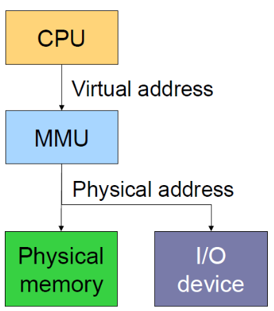

- 负责虚地址到物理地址转换的硬件单元
- 通常在片内实现，每个CPU有一个base寄存器和一个register寄存器
- 虚存地址转换为物理地址，每条load和store指令都需要地址转换
- 内存保护，检查地址是否有效
- 特殊指令操作base和bound寄存器

CPU发出的是虚地址，内存和I/O设备接收的是物理地址

*9.分段*

段间不连续分配：

- 把程序逻辑上划分为若干段：代码、栈、堆
- 每个段分配连续内存，段间不必连续
- 每个进程有一张段表：（seg, size）
- 每个段采用基址 + 长度

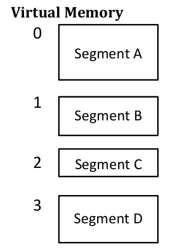

- 如果访问地址的offset >= 段size，则memory violation
- 如果访问地址所在的seg的valid为0，则segment fault
- 保护：每个段有（nil, read, write, exec）
- 上下文切换：保存/恢复段表和指向段表的内核指针
- 好处：高效，易共享
- 不足：管理复杂，外部碎片（段间碎片）

*10.分页*

- 使用固定大小的映射单元
- 把虚存划分为固定大小的单元（称为页，page）
- 把物理内存划分为同样大小的单元（称为页框，page frame）
- 按需加载

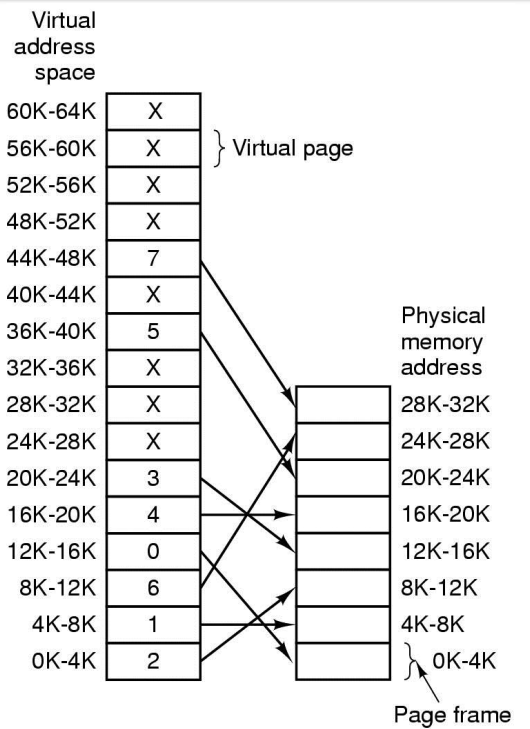

- 页表：
  - 记录 虚页 -> 物理页的映射
  - 每个进程一个页表
- 每个表项有若干个控制位：按页保护（read, write, exe）
- 上下文切换：与分段类似，保存/恢复页表地址
- 好处：分配简单，易共享
- 不足：页表很大，进程地址空间有很多空洞，对应的页表项无用

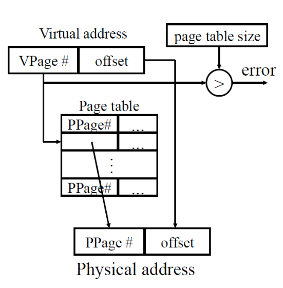

*分段 VS 分页*

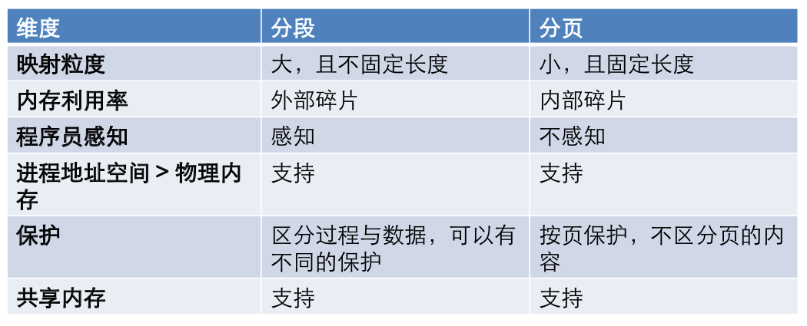

*11.页表项*

- 表达一个映射关系：虚页号 -> 物理页

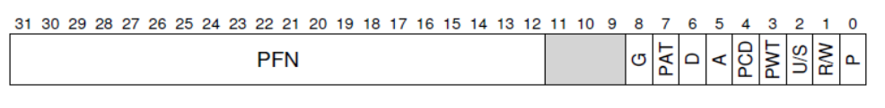

- 控制位：

  - P：标识该页在内存（Present）或不在内存（Absent）
  - R/W：read, write, exe
  - U/S：user/supervisor，标识用户态进程是否可以访问
  - A：标识该页是否被访问
  - D：标识该页是否为脏
  - G, PAT, PCD, PWT：标识Cache工作方式

*页表项（PTE）的数目*

- 假设4KB的页，低12位为页内偏移
- 32位地址的机器：
  - 每个进程的页表有$2^{20}$个页表项（~ 4MB）
  - 页表所需内存空间 = 进程数量 X $2^{20}$
  - 如果有10K个进程，内存放不下所有的页表
- 64位地址的机器：
  - 每个进程的页表有$2^{52}$个页表项
  - 页表所需内存空间 = 进程数量 X $2^{52}$
  - 一个进程的页表可能磁盘都存不下

*12.分段 + 分页*

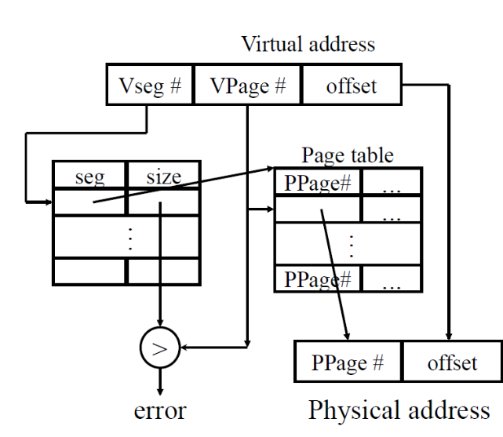

- 先将进程划分为若干段
- 每个段采用分页
- 段表记录它的页表地址

*13.多级页表*

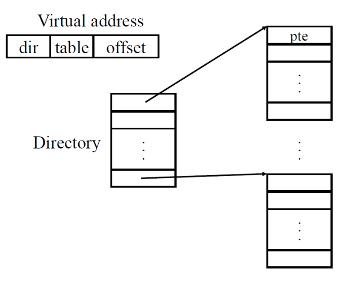

虚地址除去offset的部分划分为多个段

- 每段对应一级页表
- 多个页表

*例：二级页表*

- 每个页表4KB，1024个表项
- 下级页表每一项映射一页（4KB）
- 上级页表的每一项映射4MB的地址空间
- 对于大地址空间，大部分程序只需要几个页表

*14.反向页表*


按物理页索引，记录每个物理页对应的进程ID及虚页

- 主要思想：
  - 每个物理页一个PTE
  - 地址转换：哈希查找，Hash(Vpage, pid) -> Ppage#
- 好处：
  - 页表大小与地址空间大小无关，只与物理内存大小有关
  - 对于大地址空间，页表较小
- 坏处：查找难，管理哈希链等的开销

*15.TLB*

加速地址转换：

- 程序只知道虚地址：每个程序或进程的地址空间是[0, Max - 1]
- 每个虚地址必须进行转换：
  - 可能需要逐级查找多级页表
  - 页表保存在内存中，一个内存访问变成多个内存访问
- 解决办法：将使用最多的那部分页表项缓存在更快速的存储器中

*TLB硬件*

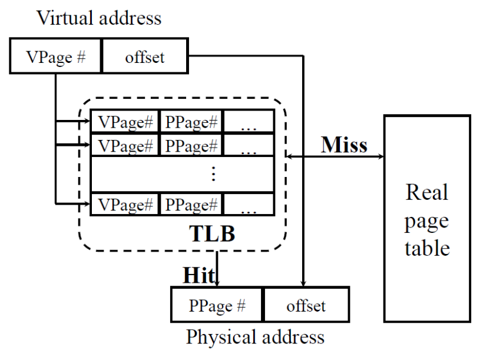

- 所有表项同时查找，速度快

*TLB表项的格式*

- 共有（必须的）的位：
  - VP#（虚页号）：与虚地址进行匹配
  - PP#（物理页号）：转换后的实际地址
  - Valid位：标识此表项是否有效
  - 访问控制位：允许用户/内核访问，以及何种访问（nil, read, write）
- 可选的位
  - 进程标签（pid）
  - 访问控制位（R位）
  - 修改标识位（W）
  - 允许缓存否

*硬件控制的TLB*

- CPU把一个虚地址VA给MMU进行转换
- MMU先查TLB，VA = VP# || offset，将该虚页号同时与TLB中所有表项相比较
- TLB hit（命中）：TLB中找到含VP#的表项
  - 如果有效（TLB的valid位为1），取表项中的物理页号
  - 如果无效，则等同于TLB miss
- 如果TLB miss（不命中）：TLB中没有含VP#的表项
  - MMU硬件在页表中进行查找，得到PTE
  - 将找到的PTE加载进TLB（如果没有空闲表项，替换一个TLB表项）
  - 并取TLB表项中的物理页号

*软件控制的TLB*

- CPU把一个虚地址vaddr给MMU进行转换
- MMU先查TLB，vaddr = vpage# || offset，将该虚页号同时与TLB中所有表项进行比较
- TLB hit：TLB中找到含vpage#的表项
  - 如果有效，取表项中的物理页号
  - 如果无效，则等同于TLB miss
- 如果TLB不命中：产生TLB fault
  - 进入内核异常处理程序（软件）
  - 如果没有空闲TLB表项，则替换一个TLB表项
  - 在页表中进行查找，得到PTE
  - 将该PTE加载进TLB
  - 重新执行发生TLB不命中的指令

*硬件控制 VS 软件控制*

- 硬件控制：
  - 高效
  - 不灵活
  - 需要更多的空间来保存页表
- 软件控制：
  - 大大简化了MMU的逻辑，使得CPU芯片上更多的面积用于缓存
  - 灵活
  - 能够处理大的虚地址空间：软件可以使用反向页表，进行哈希映射

*16.缓存 VS TLB*

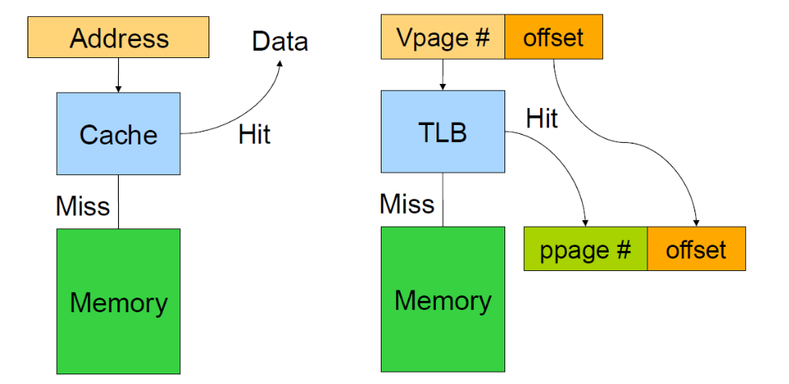

- 相似之处：缓存一部分内存，不命中时替换
- 不同之处：关联度，一致性：PTE修改

*17.TLB设计问题*

- 替换哪个TLB表项：随机或伪LRU
- 上下文切换时需要做什么：
  - 有进程标签：修改TLB寄存器和进程寄存器的内容
  - 无进程标签：作废整个TLB内容
- 修改一个页表项时需要做什么：
  - 修改内存中的PTE
  - 将对应的TLB表项置为无效（TLB flush）
- 减少TLB不命中的开销：
  - 增大TLB：很小的TLB，很好的TLB命中率
    - 不能太大，CPU的面积有限
  - 基于预测的preload
  - 页表缓存：缓存包含TLB表项的页表所在页，由软件管理

*一致性问题*

- 缓存：“侦听”协议
  - 维护DRAM的一致性，即使在有DMA的情况下
- TLB与DRAM之间的一致性：任何时候修改一个页表项都需要TLB flush
- TLB "shut down"
  - 在共享内存的多处理器上，有些内存页面同时被多个处理器访问
    - 内核页面、多个进程共享的用户页面，多线程被调度到不同的处理器上
  - 一个处理器修改一个页表项，需要所有处理器都TLB flush
  - 在TLB flush期间，所有处理器都不响应中断

*18.总结*

- 虚拟内存：虚拟化使得软件开发变得容易，而且内存资源利用率高
- 进程地址空间：分离地址空间能够提供保护和错误隔离
- 地址转换：
  - 虚地址与物理地址
  - MMU
- TLB
  - 加速地址转换的专门硬件
  - 但引入一致性问题
- 地址映射：
  - 基址 + 长度：简单，但有很大的局限性
  - 分段：有用，但太复杂
  - 分页：页与页框，页表与PTE
  - 大页表优化：分段 + 分页，多级页表，反向页表

### 页替换

*1.进程加载*

- 简单办法：将整个进程加载进内存 -> 运行 -> 退出
  - 慢（对于大进程）
  - 浪费空间（一个进程并不是时刻都需要所有的内存）
- 解决办法：
  - 按需加载页：只将实际使用的页加载进内存
  - 换页：内存中只放频繁使用的那些页
- 机制：一部分虚存映射到内存，一部分虚存映射到磁盘

*2.换页步骤*

- 内存访问（可能导致TLB不命中）
- 若TLB不命中，进行页表查找，得到PTE
- 若PTE的valid位 = 0（页不在内存），触发缺页（Page Fault）
- 虚存管理中的缺页处理接管控制，将页从磁盘读到内存
- 更新PTE：填入pp#，将valid位置为1
- 把PTE加载进TLB
- 重新执行该指令：重新进行内存访问

*换页*

- 缺页可能发生在一条指令执行的中途
- 应用程序透明：必须让用户程序不感知缺页
- 需要保存状态并从断点处继续执行

*页替换*

- 需要的页不在内存里 -> 需换入 -> 需为它分配一个页框
- 可能此时没有空闲页框
- VM需要进行页替换

*3.缺页处理*

进程A发生缺页，发生缺页的页记为VP

- 陷入内核，保存进程A的当前状态：PC，寄存器
- 调用OS的缺页处理程序：
  - 检查地址和操作类型的合法性，不合法，则给进程A发signal或者kill
  - 为VP分配一个物理页框，记为PP:
    - 如果有空闲页框PP1，则用它，PP = PP1
    - 如果没有空闲页框，选择一个状态为used页框PP2
      - 如果它是脏的（M位 = 1），则把它写回磁盘
      - PTE表项valid位置为0，flush TLB表项
      - 写回完成后，PP = PP2
  - 找到VP对应的磁盘页，把它读到这个页框（PP）中
  - 修改VP的PTE：填入PP#，将valid位置为1，并把该PTE加载进TLB
- 恢复进程A的状态，重新执行发生缺页的指令

#### 替换算法

*1.最优算法（MIN）*

- 算法：替换在未来最长一段时间里不用的页


- 前提：知道未来所有的访问
- 好处：最优方案，可作为一种离线分析手段
- 坏处：
  - 在线系统无法采用，因为不知道未来的访问顺序
  - 没有线性时间复杂度的实现

*TLB和页表*

用于换页的位：

- R位：访问标志位，当访问该页中的某个位置时置位
- M位：修改标志位，当对该页中某个位置进行写时置位

*2.NRU（Not Recently Used）*

- 算法：按下面顺序，随机选择一个页：
  - 未访问过且未修改过
  - 未访问过且修改过
  - 访问过且未修改过
  - 访问过且修改过
- 好处：可实现
- 坏处：需要扫描内存中所有页的R位和M位

*3.FIFO*

- 算法：选择最老的页换掉
- 好处：开销最小
- 坏处：频繁使用的页被替换

*4.有第二次机会的FIFO*

- 核心思想：
  - 尽量让频繁使用的页留在内存，不被替换
  - 替换时给访问过的页第二次机会，在内存中呆更长时间
- 算法：
  - 检查最老页的R位，如果为0，替换它
  - 如果为1，将它清0，并把它移到队尾，继续查找
- 好处：实现简单
- 坏处：最坏情况时可能需要很长时间

*5.Clock*

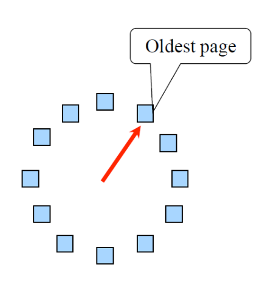

- 改进Second Chance在替换时移动页的开销
- 算法：把所有页框组织成环形链表
  - 用一个表针指向最老的页
  - 发生缺页时，按表针走动方向来检查页
- 第二次机会：
  - 如果R位为1，将其置为0，且表针向前移一格
  - 如果R位为0，替换它

*6.双表针的Clock算法*

- 对Clock的替换加以控制
- 方法：增加一个表针
  - 前表针扫描页，把R位清0
  - 后表针扫描页，把R位为0的页加入替换页链表
  - 扫描方向相同，扫描速度相同
- 替换控制
  - 扫描速度：
    - 控制替换速度
    - 空闲内存多，扫描速度慢
    - 空闲内存少，扫描速度快
  - 表针间距：
    - 页框再次被访问的时间窗口
    - 控制页在内存里的最长停留时间

*7.LRU*

- 替换最长时间没有使用的页：
  - 将所有页框组织成一个链表
  - 前端为最久未访问的页（LRU端）：替换的页
  - 后端为最近刚访问的页（MRU端）：新加载的页和命令的页
  - 每次命中将页重新插入MRU端
- 好处：对MIN算法的很好近似
- 坏处：实现困难

*8.近似LRU*

- 记录每个页访问时间戳，替换时间戳最小的页
  - 使用一个硬件计数器，每执行完一条指令，计数器加一
  - 每一个内存访问，将当前计数器值作为时间戳，保存在该页的PTE中
  - 替换时选择时间戳最小的页
  - 坏处：开销太大，不可行
- NFU：记录每个页的访问次数，替换访问次数最少的页：
  - 每页有一个访问计数器，用软件模拟
  - 每个时钟中断时，所有页的计数器分别与它的R位值相加
  - 坏处：Never Forget，过去频繁访问，现在不访问的页，替换不出去

*9.Aging*

- 消除过去访问的影响
  - 每个时钟中断时，先将所有页计数器右移一位，再将每页计数器最高位与该页的R位相加
  - 替换时，选择计数器值最小的页
- Aging与LRU的主要区别：
  - 记录下来的历史更短
  - 无法区分访问的先后顺序

*10程序的行为*

- 80/20原则：
  - 80%的访问只涉及20%的内存空间
  - 80%的访问来自20%的代码
- 空间局部性：相邻的页很可能会被访问
- 时间局部性：被访问的页很可能在不远的将来再被访问

*11.工作集*

- 主要思想：
  - 工作集被定义为在最近K次访问的那些页
  - 把工作集放进内存能大大的减少缺页
- 工作集的近似：一个进程在过去T秒钟里使用的页
- 一个算法：记录页的”上次访问时间“
  - 在缺页时，扫描该进程所有的页
  - 如果R位为1，将该页的上次访问时间设置为当前时间
  - 如果R位为0，计算当前时间与上次访问时间之差$\Delta$
    - 如果$\Delta > T$，该页在过去T秒里没有访问过，则替换它
    - 否则，检查下一页
  - 将发生缺页的页加入工作集

*12.WSClock*

- 将页框组织成环形链表
- 按表针走动顺序来检查页
- 如果R位为1:
  - 将R位置为0，该页的上次访问时间设置为当前时间
  - 检查下一页
- 如果R位为0：
  - $\Delta = $ 当前时间 - 上次访问时间
  - 如果$\Delta \le T$，该页在过去T秒里访问过，检查下一页
  - 如果$\Delta > T$，该页在过去T秒里没有访问过，而且M位为1，将该页加入写回链表，并检查下一页
  - 如果$\Delta > T$，该页在过去T秒里没有访问过，并且M位为0，替换该页

### 虚存设计

*1.颠簸*

- 频繁发生缺页，运行速度很慢
- 进程被阻塞，等待页从磁盘取进内存
- 原因：
  - 进程的工作集 > 可用的物理内存
  - 进程过多，即使单个进程都小于内存
  - 内存没有被很好的回收利用

*哪些工作集放进内存*

- 进程分为两组：
  - 活跃组：工作集加载进内存
  - 不活跃组：工作集不加载进内存
- 如何确定哪些进程是不活跃的
  - 等待事件
  - 等待资源
- 两个调度器
  - 长期调度器决定：
    - 哪些进程可以同时运行
    - 哪些是不活跃的进程，把它们换出到磁盘
    - 哪些是活跃的进程，把它们换入内存
  - 短期调度器决定把CPU分配给哪个调度器

*如何选择被替换的页*

- 全局选择：
  - 从所有进程的所有页框中选择
  - 可替换其它进程的页框
- 局部选择：只从本进程的页框中选择

*全局选择 VS 局部选择*

- 全局选择：
  - 从所有进程的所有页框中选择
  - 可替换其他进程的页框
  - 每个进程运行期间，其内存大小是动态变化的
  - 好处：简单
  - 坏处：没有隔离，受其它进程的页替换干扰，不能控制各个进程的内存使用量
- 局部选择：
  - 只从本进程自己的页框中选择
  - 一个进程运行期间，其内存大小是不变的
    - 页框池：分配给进程的页框的集合，进程间池大小可不同
  - 好处：隔离，不影响其它进程
  - 坏处：不灵活，进程增大会出现颠簸，难以充分利用内存（每个进程对内存的需求不一样）

*2.平衡分配*

局部选择 + 池大小动态分配

- 每个进程有自己的页框池
- 从自己的池中分配页，且从自己的工作集中替换页
- 用一种机制来运行时动态调整每个池的大小
- 进程加载方式：进程换入时
  - 纯粹的按需加载页 -> 大量的page fault -> 加载慢
  - 预加载：先加载部分页 -> 初始池大小
  - 如果初始池大小 ~ 工作集 -> 加载快，减少page fault开销
- 初始池大小：
  - 固定分配：所有进程都一样
  - 平均分配：
    - 内存总量 / 当前运行态进程数量
    - 进程大小差异很大
  - 根据进程大小按比例分配：
    - （进程大小 / 当前运行态进程的总大小）X 内存数量
    - 当前运行的进程的总大小是变化的
- 动态调整池大小：进程大小变化
  - PFF算法
    - 缺页率PFF：进程每秒产生多少次缺页
    - 对于大多数替换策略，PFF随分配给进程的内存增加而减少
  - 根据进程的PFF来调整分配给它的内存量
    - 两个阀值A和B，A为上限，B为下限
    - 当PFF高于A，就增加其内存
    - 当PFF低于B，就减少其内存

*3.钉住页（pin/lock）*

- DMA进行过程中，需要传输的页不能被换出，否则CPU就会把新内容写入这些页
- 系统调用接口：
  - pin：把虚页钉在内存，使它们不会被换出
  - unpin：取消pin，使它们可以被换出
- 如何设计：
  - 用一个数据结构来记录所有被钉住的页
  - 换页算法在替换页时检查该数据结构，如果页被钉住，则不替换它，重新选择一页

*4.交换空间管理*

- 交换区
  - 后备存储
  - 在磁盘上
  - 专门用于存储进程换出页
  - 交换分区：用专门的磁盘分区
  - 交换文件：用一些文件
- 交换空间管理：
  - 静态分配
  - 动态分配

*静态分配*

- 创建进程时分配，进程结束时回收
- 大小：进程映像
- 进程控制表记录交换空间的磁盘地址
- 绑定：一个虚存页 <--> 一个磁盘页，磁盘页称为shadow page
- 初始化：
  1. 按需换入：进程映像拷贝到交换区
  2. 按需换出：进程映像加载进内存
- 缺点：难以增长

*动态分配*

- 创建进程时不分配
- 页换出时分配，页换入时回收
- 虚页与磁盘页不绑定，多次换出，分配不同的磁盘页
- PTE中记录页的磁盘地址
- 一个优化：程序正文段
  - 直接用磁盘中的可执行文件作为交换区
  - 换出时直接抛弃
  - 好处：减少了交换区的大小，减少了不必要的拷贝和写回

*PTE*

- 虚页 -> 页框和磁盘
- 如果valid bit = 1，对应物理页号pp#
- 如果valid bit = 0，对应磁盘页号dp#

*换出*

- 将PTE和TLB置为无效
- 将页拷贝到磁盘
- 将磁盘页号填入PTE

*换入*

- 找一个空闲页框（可能触发替换）
- 将页从磁盘拷贝到这个页框中
- 将页框号填入PTE中，并将PTE置为有效

*5.清零页*

- 将页清零
  - 把页置为全0
  - 堆和栈的数据都需要初始化
- 对于数据段和栈段的页，当它们第一次发生page fault时，将它们清零
- 有一个专门的线程来做清零

*6.共享页*

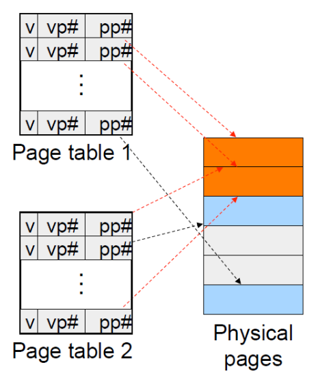

- 两个进程的页表共享一些物理页

*7.写时复制（copy on write）*

- 该技术用于创建子进程（fork系统调用）
- 原理：
  - 子进程的地址空间使用其父进程相同的映射
  - 将所有的页置成read-only
  - 将子进程置成ready
  - 对于读，没有问题
  - 对于写，产生page fault:
    - 修改PTE，映射到一个新的物理页
    - 将页内容全部拷贝到新物理页
    - 重新运行发生缺页的指令

*8.UNIX的地址空间*

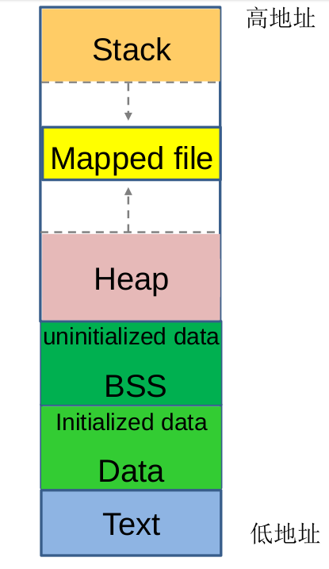

- 正文段：只读，大小不变
- 数据段：
  - 初始化数据
  - 未初始化数据：BSS
  - brk区用于增长或缩小
- 栈段
- 内存映射文件
  - 将一个文件映射进虚存
  - `mmap`和`unmap`
  - 像访问内存一样访问文件

*9.Linux地址空间*

- 32位地址空间：3GB用户空间，1GB内核空间
- 栈段从3GB位置向下增长，初始时保存进程的环境变量和命令行参数
- 数据段：大小可变，BSS为未初始化的全局变量，页加载时初始化为0
- 2.6.11及以后的Linux使用4级页表
- 物理页分配采用伙伴算法

*10.Linux的页替换*

方法：

- 保持一定数量的空闲页
- 文件缓存，未使用的共享页使用Clock算法
- 用户进程的内存使用改进的Clock算法

改进的Clock算法：

- 两条LRU链
- Active list：所有进程的工作集
- Inactive list：回收的候选页
- Refill将页从Active list移动到Inactive list


## Chapter05 输入/输出

### I/O设备

*1.输入和输出*

- 计算机的工作是处理数据
  - 计算：CPU，高速缓存，内存
  - 将数据传入及传出计算机系统：数据在I/O设备以及内存之间来回传输
- I/O设备面临多种挑战：多种类型、大量产商、需要大量设备驱动，设备驱动运行于内核态，其bug常常引发宕机
- OS的目标：
  - 提供一种通用的、一致的、方便的、可靠的方法来访问各种I/O设备
  - 充分发挥I/O设备的性能

*2.硬件架构*

- 计算机硬件
  - CPU核和高速缓存
  - 内存控制器
  - 内存
  - I/O总线
- I/O硬件
  - I/O总线或互连
  - I/O设备控制器或适配器
  - I/O设备

*3.设备控制器*

- 控制设备的逻辑：解析主机发来的命令，控制设备进行操作
- 组成：
  - 与主机的接口：用于与主机之间的信息传递
    - 硬件接口：PCie, SATA, USB
    - 接收主机的命令和数据，或把设备的数据和状态等返回给主机
  - 控制寄存器：1个或多个，用于控制设备操作
    - 写控制寄存器，命令设备干指定的事情，比如传数据、接收数据、开、关
    - 读设备寄存器，获得设备的状态，比如忙、闲、就绪
  - 数据缓冲区：用于数据缓冲或缓存，DRAM
    - 缓冲CPU发给设备的数据
    - 缓存设备的数据

*4.与I/O设备进行交互：寻址*

- I/O端口：独立的I/O端口空间
  - 端口号：8位或16位的数值
  - 只能通过I/O指令访问
  - I/O指令是特权指令，用户程序不能访问
  - 内存地址空间与I/O地址空间分离
    - 控制线：指示CPU发出的地址是内存空间还是I/O空间
- 内存映射I/O：使用统一地址空间
  - 预留一部分内存地址空间
  - 内存地址与I/O地址无重叠
    - CPU发出的地址，所有内存模块和所有设备都要解析
  - 优势：访存指令可以用来访问设备的控制寄存器
    - 编程方便
    - 保护方便、灵活：利用虚存的保护机制，放在内核空间或某个进程的虚空间
    - 高效：减少指令

*5.与I/O设备进行数据传输*

- 数据传输
  - 启动设备 + 数据传输
  - 启动时间（开销）：CPU用于启动设备进行操作的时间
  - 带宽：启动设备后数据传输的速率
  - 延迟：传输一字节的时间 = 启动时间 + 将一字节传输到目的地的时间
- 通用方法：
  - 不同的传输速率
  - 字符设备：对字节流传输的抽象，打印机、网卡等，以若干字节为传输粒度，从而分摊开销
  - 块设备：以块为存储粒度和传输粒度，按块寻址，整块读写

#### 数据传输方式

*1.PIO（Programmed I/O）*

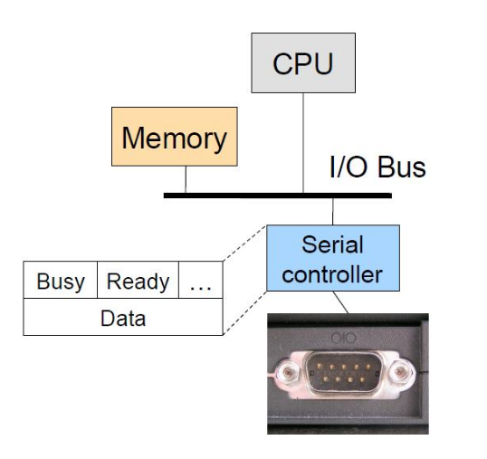

- 简单的串行控制器
  - 状态寄存器：就绪，忙...
  - 数据寄存器
- 查询输出：
  - CPU：
    - 等待设备状态变为非“忙”
    - 写数据到数据寄存器
    - 通知设备“就绪”
  - 设备：
    - 等待直到状态变为“就绪”
    - 清除“就绪”标志，设置“忙”标志
    - 从数据寄存器中拿走数据
    - 清除“忙”标志

*PIO的轮询*

- 等待直到设备状态变为非“忙”
  - 轮询：不停的检查设备状态，“忙等”
- 好处：简单
- 坏处：慢，浪费CPU
- 改进：中断机制可避免CPU轮询

*2.中断*

例子：鼠标

- 简单的鼠标控制器：状态寄存器 + 数据寄存器
- 输入：
  - 鼠标：
    - 等待直到设备状态变为“完成”
    - 将$\Delta X,\Delta Y$和按键的值保存到数据寄存器
    - 发中断
  - CPU（中断处理）
    - 清除“完成”标志
    - 将$\Delta X,\Delta Y$和按键的值读到内核缓冲区（内存）中
    - 置“完成”标志
    - 调用调度器

*3.DMA*

例子：磁盘

- 一个简单的磁盘控制器
  - 状态寄存器
  - DMA内存地址和字节数
  - DMA控制寄存器：命令、设备、传输模式及粒度
  - DMA数据缓冲区
- DMA写：
  - CPU：
    - 等待DMA设备状态为“就绪”
    - 清除“就绪”
    - 设置DMA命令为write，地址和大小
    - 设置“开始”
    - 阻塞当前的进程/线程
  - 磁盘控制器：
    - DMA方式将数据传输到缓冲区（count--; addr++）
    - 当count == 0，发中断
  - CPU（中断处理）
    - 将被该DMA阻塞的进程/线程加到就绪队列
    - 将数据从缓冲区写入磁盘

*4.I/O软件栈*

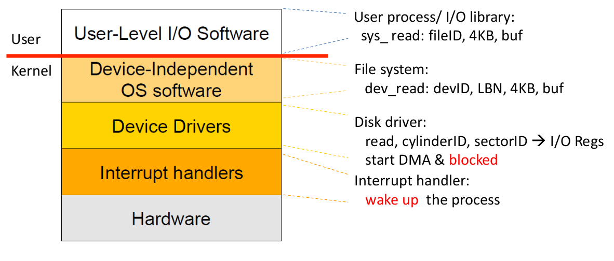

*5.设备驱动*

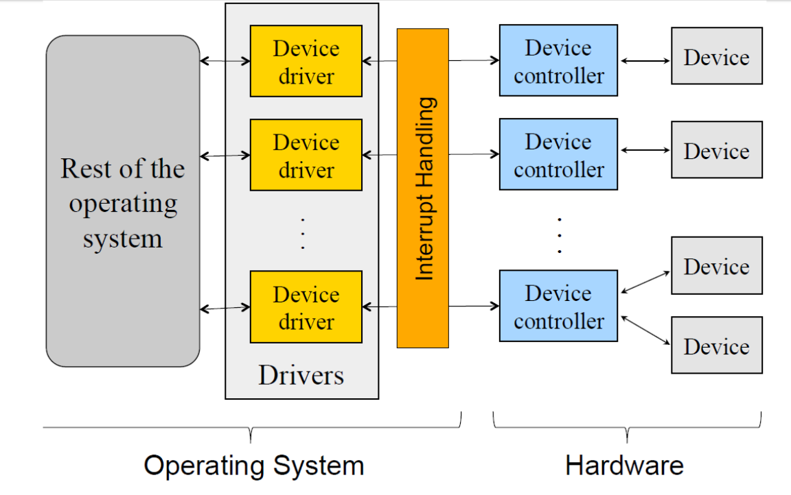

- 给操作系统的其他模块提供操作设备的API
- 与设备控制器交互
  - 与设备控制器进行交互以进行数据传输：命令、参数、数据
- 主要功能
  - 初始化设备
  - 解析OS发来的命令
  - 多个请求的调度
  - 管理数据传输
  - 接收和处理中断
  - 维护驱动与内核数据的完整性

*6.设备驱动操作接口*

- `init(deviceNumber)`：初始化硬件
- `open(deviceNumber)`：初始化驱动并分配资源
- `close(deviceNumber)`：清除，回收资源，关闭设备
- 设备驱动的类型：
  - 字符设备：可变长度的数据传输
    - 字符设备接口：
      - `read(deviceNumber, bufferAddr, size)`：从字节流设备上读"size"字节数据
      - `write(deviceNumber, bufferAddr, size)`：将"bufferAddr"中“size"字节数据写入字符流设备
  - 块设备：以固定大小的块为粒度的数据传输
    - 块设备接口：
      - `read(deviceNumber, deviceAddr, bufferAddr)`：从设备传输一个块的数据到内存
      - `write(deviceNumber, deviceAddr, bufferAddr)`：从内存传输一个块的数据到设备
      - `seek(deviceNumber, deviceAddr)`：将磁头移动到指定块

*7.UNIX设备驱动接口*

- `init()`：初始化硬件
- `start()`：开机时初始化，需要系统服务
- `halt()`：在系统关机前要调用
- `intr(vector)`：在发生硬件中断时由内核调用
- `read(...)`, `write(...)`：数据传输
- `poll(pri)`
- `ioctl(dev, cmd, arg, mode)`：特殊请求处理

*8.设备驱动的工作流程*

- 准备工作
  - 参数检查，请求格式转换
  - 设备状态检查：忙 -> 请求入队列
  - 可能开设备或上电
- 操纵设备
  - 将控制命令写入设备的控制寄存器
  - 检查设备状态：就绪 -> 写下一命令
  - 直到设备完成所有命令
- 阻塞等待
  - 等待设备完成工作
  - 被中断唤醒
  - 有的设备不需要等待，如显示器
- 错误处理：检查设备返回结果，如果错误，可能重试
- 返回调用者

*9.设计问题*

- 静态安装设备驱动：新设备的启动需要重启OS
- 动态挂载设备驱动：
  - 不需要重启，而是采用间接指针
  - 将驱动加载进内核空间
  - 安装入口点，维护相关的数据结构
  - 初始化设备驱动

*动态绑定设备驱动*

- 间接指针
  - 设备入口点：所有设备的入口点
- 加载设备驱动：
  - 分配内核空间
  - 存储驱动代码
  - 与入口点关联
- 删除设备驱动：
  - 删除入口点
  - 释放内核空间

*10.设备驱动的利与弊*

- 灵活性：
  - 用户可以下载和安装设备驱动
  - 供应商可以基于开放硬件平台
- 安全隐患：
  - 设备驱动运行于内核态
  - 有bug的设备驱动会导致内核崩溃，或者引入安全漏洞
- 如何让设备驱动更安全：
  - 检查设备驱动的代码
  - 为设备驱动构建状态机模型

*11.同步I/O与异步I/O*

- 同步I/O：
  - `read()`和``write()``将阻塞用户进程，直到读写完成
  - 在一个进程做同步I/O时，OS调度另一个进程执行
- 异步I/O：
  - `aio\_read()`和`aio\_write()`不阻塞用户进程
  - 在I/O完成之前，用户进程可以做其他事情
  - I/O完成将通知用户进程

*同步读*

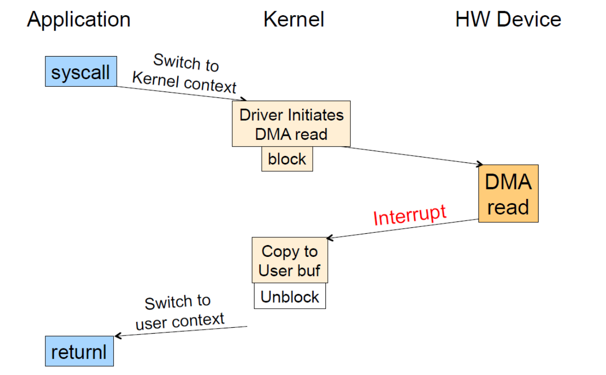

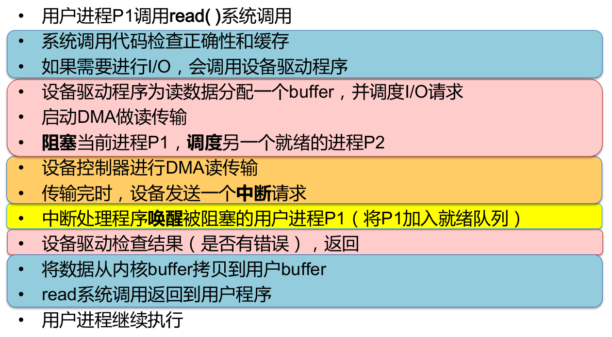

*异步读*

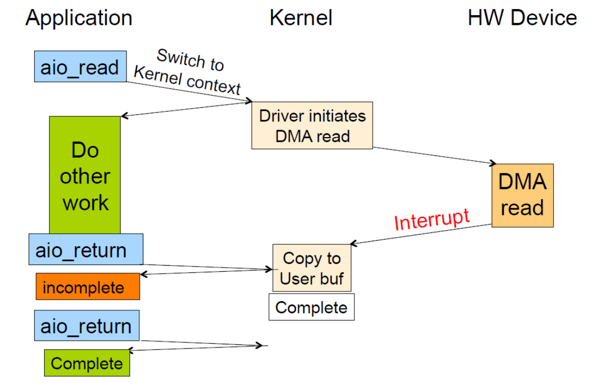

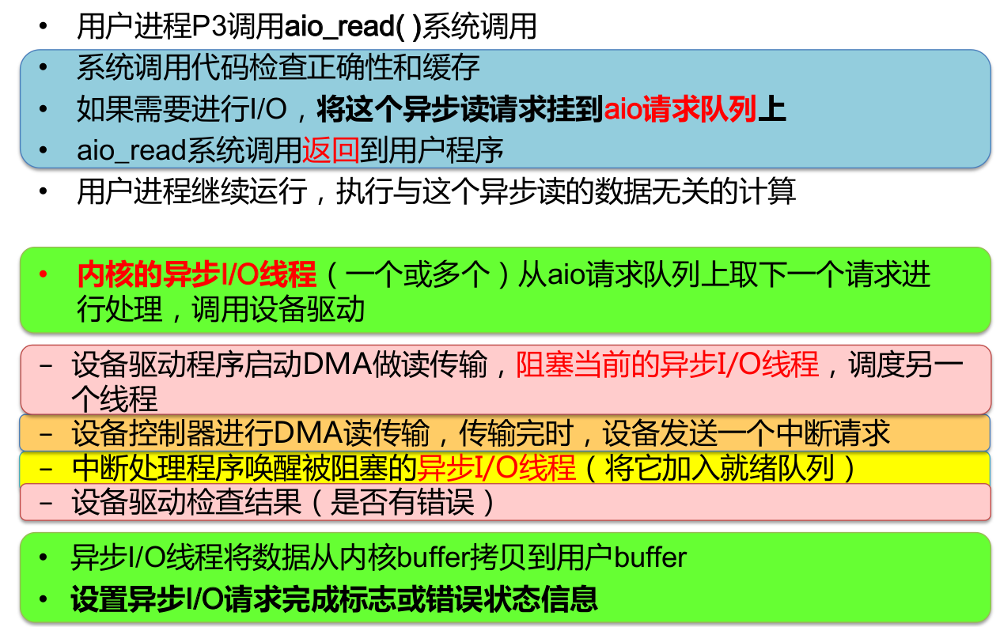

*12.为什么内核需要缓冲*

- 生产者与消费者之间速度不匹配
  - 字符设备和块设备等
  - 适配不同的数据传输大小
- DMA需要连续的物理内存
  - I/O设备看到的是物理内存
  - 用户程序使用的是虚拟内存
- 缓存
  - 服务对同一数据的请求
  - 减少I/O操作

*总结*

- I/O设备
  - PIO简单，但不高效
  - 中断机制支持CPU和I/O重叠
  - DMA高效，但需要复杂的软件
- 设备驱动
  - 直接操纵设备的代码
  - OS代码量中占主导
  - 设备驱动引入安全漏洞
- 异步I/O
  - 异步I/O允许用户程序的计算与I/O重叠

### 磁盘和RAID

*1.磁盘*

- 持久化的，大容量，低成本的存储设备：机械，速度慢
- 多种尺寸
- 多种容量
- 多种接口

*典型的磁盘控制器*

- 与主机的接口：SATA, SAS, FC
- 缓存：缓冲数据
- 控制逻辑：
  - 读写请求
  - 请求调度
  - 缓存替换
  - 坏块检测和重映射

*磁盘的结构*

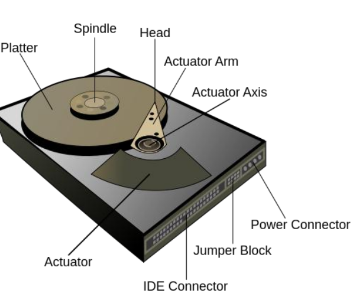

- 盘片：一组，按一定速率旋转
- 磁道：
  - 用于盘片表面的同心圆
  - 用于记录数据的磁介质
  - bit沿着每条磁道顺序排列
- 扇区：磁道划分为固定大小的单元，一般为512字节
- 磁头：一组，用于读写磁道上的数据
- 磁臂：一组，用于移动磁头
- 柱面：由所有盘片上半径相同的磁道组成
- Zone：
  - 不同磁道的扇区数目不同：外道多，内道少
  - 所有柱面划分为Zone，同一Zone每条磁道的扇区数目相同

*2.磁盘扇区*

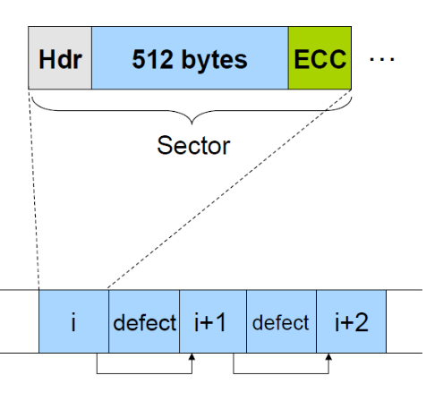

- 扇区的创建：
  - 磁盘格式化
  - 逻辑块地址映射到物理块地址
- 扇区的格式：
  - 头部：ID，损坏标志位...
  - 数据区：实际用于存储数据的区域
  - 尾部：ECC校验码
- 坏扇区：发现坏扇区，先用ECC纠错，如果不能纠错，用备用扇区替代，坏扇区不再使用
- 磁盘容量：格式化损坏20%左右（每个扇区的头部、尾部加坏扇区）

*读写操作*

读写某个柱面的某个扇区：

- 定位柱面，移动磁臂使磁头对准柱面：寻道seek
- 等待扇区旋转到磁头下方：旋转rotation
- 进行数据读写：数据传输

*3.磁盘性能*

- 有效带宽 = 数据量 / 耗时
- 耗时：
  - 寻道时间：把磁头移动到目标柱面的时间
  - 旋转延迟：等待目标扇区旋转到磁头下方的时间
  - 数据传输时间
- 对于小粒度的访问，时间主要花费在寻道时间和旋转时间上
  - 磁盘的传输带宽被浪费
  - 缓存：每次读写临近的多个扇区，而不是一个扇区
  - 调度算法：减少寻道开销

*4.磁盘缓存*

- 方法：
  - 用少量的DRAM来缓存最近访问的块
  - 由控制器管理，OS无法控制
  - 块替换策略：LRU
- 优点：如果访问具有局部性，读性能收益
- 缺点：需要额外的机制来保障写的可靠性

#### 请求调度算法

*1.FIFO*

- 按照请求到达的先后顺序依次服务
- 好处：公平性，服务顺序是应用预期的
- 坏处：
  - 请求到来的随机性，经常长距离的寻道
  - 可能发生极端情况，比如横扫整个磁盘

*2.SSF（shortest seek first）*

- 方法：选择磁头移动距离最短的请求，记入旋转时间
- 好处：试图减少寻道时间
- 坏处：可能会产生饥饿

*3.电梯调度*

- 方法：
  - 磁头按一个方向到另一端，再折回，按反方向回到这端，不断往返
  - 只服务当前移动方向上寻道距离最短的请求
  - LOOK：如果磁盘移动方向上没有请求，就折回
- 好处：消除饥饿，请求的服务时间有上限
- 坏处：反方向的请求需等待更长时间

*4.C-Scan（Circular Scan）*

- 方法：
  - 将SCAN改为折回时不服务请求
  - 类似将两类连起来成一个环
  - C-LOOK
- 好处：服务时间趋于一致
- 坏处：折回时不干事

*4.RAID*

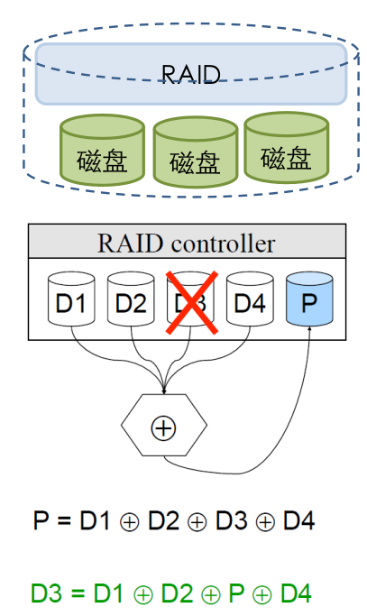

- 主要思想：由多个磁盘构成一个存储设备
- 好处：
  - 提高性能：多个磁盘并行工作
  - 提高容量：聚合多个磁盘的空间
  - 提高可靠性：数据冗余，磁盘损坏，数据不损坏
- 坏处：成本高，控制器变得复杂
- 牵涉的问题：
  - 块映射：逻辑块LBN -> <磁盘#, 块#>
  - 冗余机制

*5.RAID0-0*

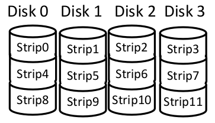

- 以条带为粒度映射到N个磁盘（轮转）
- 1 strip = n个块
- 无冗余
- 容量：N X 当个磁盘容量
- 可靠性：$\text{(单个磁盘可靠性)}^N$
- 性能：
  - 带宽 = N X 单个磁盘带宽
  - 延迟 = 单个磁盘延迟

*6.RAID-1*

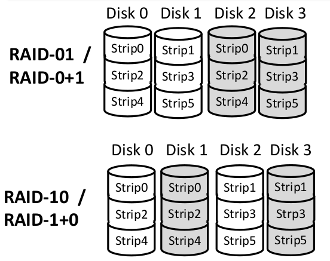

- 镜像
- 镜像级别R：数据存R份
- 通常与RAID-0结合使用：RAID-01或RAID-10
- 容量：（N X 单个磁盘容量）/ R
- 可靠性（R = 2）
  - 容忍任何一个磁盘坏
  - 特殊情况下可容忍 N/2 个磁盘坏
- 带宽：
  - 写带宽：（N X 单个磁盘写带宽）/ 2
  - 读带宽：N X 单个磁盘读带宽
- 延迟：
  - 读延迟：等于单个磁盘读一块的延迟
  - 写延迟：略大于单个磁盘写一块的延迟

*7.RAID-4*

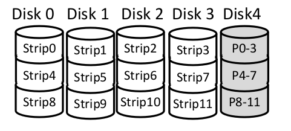

- 条带化 + 一个校验块
- 所有校验块在同一块磁盘上（校验盘）
- 缺点：校验块为写性能瓶颈，易坏

每次写都更新校验块：

方法一：读所有数据盘

1. 并行读所有磁盘对应的块
2. 计算新校验块
3. 并行写新块和新校验块

方法二：读一个数据盘和磁盘块

1. 并行读一个旧数据块和旧校验块
2. 计算新校验块：$Pnew = (Bold \oplus Bnew) \oplus Pold$
3. 并行写新块和新校验块

- 容量：（N - 1）X 当个磁盘容量
- 可靠性：只容忍任何一个磁盘坏，用XOR重构坏盘数据
- 延迟：读延迟等于单个磁盘的延迟写延迟约等于2倍单个磁盘延迟
- 带宽：
  - 读带宽 = （N - 1）X 单个磁盘带宽
  - 校验盘为写瓶颈，所有校验块串行写
  - 写带宽 = 单个磁盘带宽 / 2

*8.RAID-5*

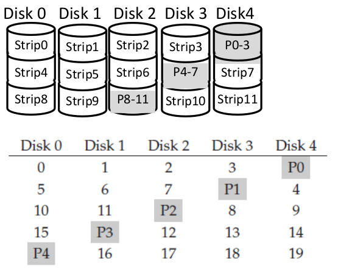

- 条带粒度映射 + 一个校验块
- 校验块分散在不同的磁盘上
- Rebuild：复杂，速度慢
- 写带宽 = （N X 单个磁盘带宽）/ 4，校验块并行写

*9.卷管理*

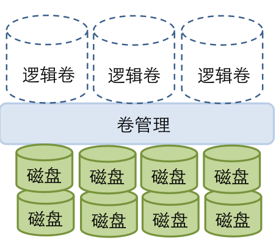

- 虚拟块设备：
  - 将多个磁盘聚集起来，在其上创建一个或多个逻辑卷
  - 逻辑卷：一个虚拟块设备
  - 采用RAID技术将逻辑卷的块地址映射到物理设备
  - 提供虚拟的容量和性能：增大或缩小逻辑卷不影响已存储的数据
- 提供可靠的块存储：
  - 采用RAID技术容忍物理设备故障
  - 提供块级别的错误发现
- 实现：
  - OS内核的逻辑卷管理：Windows, MacOS, Linux等
  - 存储设备控制器（存储系统）

*10.存储系统的演进*

- 企业数据中心：
  - 数据集中存储
  - 大容量、高可靠、高可用的存储系统
- SAN存储系统：
  - SAN：存储专用网络
  - FC或iSCSI接口
  - 多主机共享
- 容灾：远程恢复，由备份生成远程镜像，或者将远程镜像合并到备份中
- 存储架构演进：NAS -> NAS + Dedup -> 全球范围的分布式存储

*11.总结*

- 磁盘：
  - 内部很复杂
  - 密度按摩尔定律增长
  - 大块读写才能获得高带宽
  - 需要磁盘调度来减少寻道开销
- RAID提高了可靠性和I/O带宽
- 卷管理提供虚拟块设备
- 存储系统是一个复杂的专用系统：
  - 硬件&软件（存储设备控制器）
  - 企业存储系统已发展成复杂的分布式系统

### SSD

*1.闪存（Flash memory）*

- 全电子器件，无机械部件
- 非易失性存储


*2.基于闪存的Solid State Drive（SSD）*

- 用很多闪存芯片来构成一个持久化存储设备SSD
- 多个闪存芯片：并行I/O，提高I/O性能
- 与主机的接口：提供标准块设备接口
- 数据缓存与缓冲：SRAM
- 闪存控制器固件FTL：控制逻辑
  - 主机命令转换成闪存命令
  - 逻辑块地址转换成闪存的物理地址
  - 缓存替换
  - 页聚合写

*3.闪存组织*

- 页：
  - 由数据区和Out of Band(OOB)区组成
  - 数据区用于存储实际数据
  - OOB区用于记录：ECC，状态信息，逻辑页号
  - 页大小：4KB ~ 16KB
  - 数百页每块
  - 块大小：~MB

*4.闪存的操作接口*

读：read a page

- 读的粒度是页
- 读很快
- 读延迟与位置无关，也与上一次读的位置无关

擦除：erase a block

- 把整个块写成全1
- 擦除的粒度是块，必须整块擦除
- 很慢
- 需软件把块内有效数据拷贝到其他地方

写：program a page

- 擦除后才能写，因为写只能把1写成0
- 写的粒度是页
- 写比读慢，比擦除快

*页的状态*

Invalid, Erased, Valid

- 初始状态为Invalid
- 读：不改变页的状态
- 擦除：块内所有页的状态变为Erased
- 写：只能写状态为Erased的页，写完后，页状态变为Valid

*5.闪存的性能和可靠性*


- 性能：
  - 写延迟比读高十倍多
  - 写延迟波动幅度大
  - 擦除很慢：磁盘定位延迟
  - 延迟随密度增加而增大
- 可靠性：
  - 磨损：擦写次数有限，随密度增加而减少
  - 干扰：读写一个页，相邻页中一些位的值发生翻转

*6.SSD面临问题*

- 一个基本问题：逻辑块与物理块的映射
- 挑战：擦除后写，读快写慢，毫秒级擦除操作
- SSD内部硬件（数据通路）：数据传输，数据读/写/擦除（Flash控制器）
- SSD内部固件（软件）：
  - Flash Translation Layer（FTL）
  - 地址映射
  - 垃圾回收
  - 环块管理

*7.最简单的FTL：直接映射*

逻辑块的第N块直接映射到物理页的第N页

- 读操作很容易：读逻辑第K块 = 读物理第K页
- 写操作很麻烦：写逻辑第K块
  - 第K页所在闪存块，记为B0
  - 把B0整个块读出来
  - 把B0整个块擦除
  - B0中的旧页和新的第K页：以顺序方式一页一页再写入B0
- 缺陷：写性能极差，小粒度随机写性能比磁盘还差

*8.Log-Structure FTL：页级映射*

- 核心思想：异地更新
  - 像LFS那样顺序写闪存
  - 每次写页，写到一个新位置，即写到日志末尾
  - 映射表：LBN -> 物理页地址PPA
- 写一个逻辑页K：
  - 写到当前块中下一个空闲页
  - 在映射表中记录：逻辑页K -> 物理页P
- 读一个逻辑页K：
  - 查映射表，获得逻辑页K对应的物理页地址P
  - 读物理页P
- 页级映射表：LBN -> PPA
  - 整个放在内存中
  - 持久化：利用页的OOB区来保存映射表
  - 随着写页而被写到闪存
  - 掉电或重启，扫描OOB区恢复映射表
- 优点：
  - 性能更好，减少写放大
  - 可靠性更好，自动写所有页
- 问题：
  - 重写逻辑页产生垃圾页：每次写到新位置，导致原先页的内容无效
  - 内存开销大：映射表全部放在内存，映射表的大小和SSD容量成正比

*9.垃圾回收*

- 思想：
  - 选择一个含垃圾页的擦除块
  - 把其中的活页拷贝到日志末尾（读&重写）
  - 回收整个块，并把它擦除
- 判断页的死活：
  - 每页记录它对应的逻辑块地址（OOB）
  - 查映射表，如果映射表中该逻辑块对应的物理页是该页，则该页是活页
- 问题：开销非常大
  - 活页需拷贝：读&写
  - 开销与活页所占的比例成正比

*10.块级映射*

- 块级映射：
  - 逻辑地址空间划分成chunk，chunk size = 物理块size
  - 映射表：chunk# -> 物理块地址PBA
- 读一个逻辑页：
  - 逻辑页地址 = chunk# + 偏移
  - 用chunk#查映射表，获得对应的物理块地址PBA
  - 物理页地址 = PBA + 偏移
- 问题：小粒度写性能差
  - 写粒度小于物理块：拷贝活页，写放大
  - 小粒度写很常见

*11.混合映射*

- 思想：
  - 将物理块划分为两类：数据块和日志块
  - 逻辑块都写入日志块
  - 数据块采用块级映射，数据映射表
  - 日志块采用页级映射，日志映射表
  - 适当的时候把日志块合并为数据块
- 读一个逻辑块：
  - 先查日志映射表，按页级映射的方法
  - 如果没找到，再查数据映射表，按块级映射的方法

*switch merge*

- 把日志块直接转成数据块：前提是整个日志块的顺序与chunk一致
- 把原来的数据块回收擦除
- 优点：开销小，只修改映射表，无数据拷贝

*Partial merge*

- 从数据块拷贝部分页到日志块：日志块前部页序与chunk一致
- 把日志块转成数据块，把原来的数据块回收擦除
- 有数据拷贝开销

*Full merge*

- 分配一个新的日志块，从数据块和日志块分别拷贝部分页到新日志块
- 把新日志块转成数据块
- 把原来的数据块和日志块都回收擦除
- 开销很大，需要拷贝整个物理块的数据

*12.磨损均衡*

- 目标：让所有块被擦除的次数近似
- 动态磨损均衡：
  - 每次写时，选择擦除次数较少或最少的块
  - 局限性：不同数据的修改频率不同
- 静态磨损均衡：
  - 不会被回收的物理块：长时间不再修改的逻辑块，冷块
  - 不再重写，不再有磨损
  - 解决办法：FTL定期重写冷块

*总结*

- 闪存的特性：
  - 读延迟很低：随机读的性能远优于硬盘
  - 写慢：必须先擦除再写
  - 磨损：每个块擦写次数有上限
- FTL的主要功能：

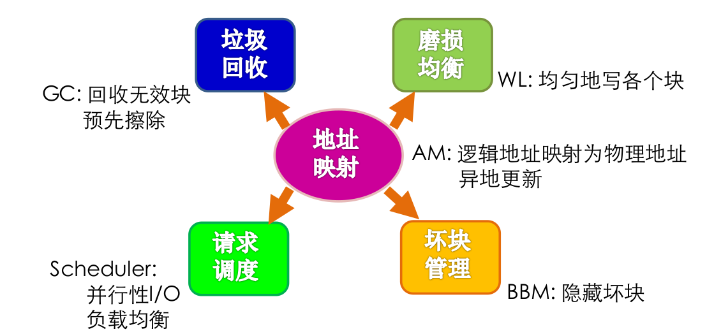

## Chapter06 文件系统

### 文件系统基础

*1.为什么需要文件系统*

- 持久化保存数据需求
  - 进程结束，关机/关电，宕机，掉电
  - 持久化存储设备：磁盘，SSD等
- FS是对持久化数据存储的抽象
  - 给用户和程序开发者提供一个逻辑上的持久化存储：简单，易理解，操作方便
  - 将复杂的、公共的管理功能从用户程序中移出
  - 简化编程 -> 加速计算机应用的发展
- 对FS的基本需求
  - 能够保存大量复杂多样的信息 -> 管理问题
  - 多个进程同时访问 -> 并发控制，语义问题
  - 多用户共享&私有 -> 保护问题


*2.文件系统的用户视图*

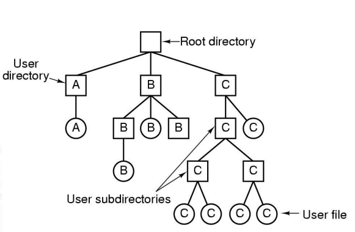

- 文件：数据组织的单位
  - 文件是命名的字节数组
  - 用户将数据组织成文件，根据文件名来访问对应的数据
  - FS不感知文件的内容：使用它的进程解析内容
- 目录：文件组织的单位
  - 一组文件和目录的命令集合
  - 父目录、子目录
  - 无重名
- 名字空间：树形层次结构
  - 文件系统的逻辑视图

*3.文件*

- 文件名：由字母、数字及某些特殊字符组成的字符串
  - 用户根据文件名来访问文件
  - 大多数OS中文件名不超过255个字符
  - 文件扩展名：描述文件的用户，如 .c, .h, .gz, .tex, .pdf 
- 文件属性：
  - 文件大小、所有者、时间戳、访问权限
  - 文件逻辑地址：指示数据在文件中的地址
- 文件内容：无结构
  - OS将文件视为无结构的字符数组
  - 程序开发者可以定义任意结构的文件
- 文件的类型：常规文件、目录文件、设备文件、可执行文件
- 文件的访问：
  - 打开文件 & 文件描述符
  - 当前位置：文件逻辑地址，[0, fsize -1] （每个文件）
  - 访问方式：读、写、执行
- i-node：FS用来描述文件的数据结构
  - 每个文件用一个i-node来描述
  - 文件元数据
  - ino：inode number，唯一标识一个文件（在一个FS内）

*4.文件访问接口（系统调用）*

- 创建文件：`fd = creat(fname, mode)`，fd为文件描述符
- 删除文件：`unlink(fname)`
- 打开文件：`fd = open(fname, flags, mode)`
- 关闭文件：`clode(fd)`
- 读文件：`rn = read(fd, buf, count)`，从当前位置读count个字节到buf中
- 写文件：`wn = write(fd, buf, count)`，从当前位置写count个字节
  - 追加写：用O_APPEND模式打开文件
- 定位文件：`lseek(fd, offset, whence)`
- 写回文件：`fsync(fd)`
- 截断文件：`truncate(fname, length)`
- 获取属性：`stat(fname, attbuf)`或`fstat(fd, attbuf)`

*5.文件访问模式*

- 顺序访问：
  - 从头到尾依次访问每个文件块
  - 例子：观看一部电影，阅读一篇文章
  - 顺序访问文件不等于磁盘上顺序访问扇区
- 随机访问：
  - 每次随机访问一个文件块
  - 例子：读邮箱中的邮件
- 按关键字访问：
  - 查找包含关键字的文件及段落
  - FS没有提供此功能
  - 例子：数据库查找和索引

*6.目录*

- 路径：
  - 根目录 & 当前目录
  - .：当前目录
  - ..：父目录
  - 绝对路径 VS 相对路径
- 目录：一种特殊的文件
  - 具有名字和属性
  - 目录和文件用相同的数据结构：inode，用一个标志i_mode来区分文件和目录
  - 目录内容：描述它所包含的目录和文件集合
    - 有结构：逻辑上是一张表
    - 目录项：每个成员一项
    - 不同FS采用不同的结构
    - 由FS负责维护和解析目录内容
    - 访问文件 VS 访问目录：不同的系统调用

*7.目录访问接口：系统调用*

- 创建目录：`mkdir(dirname, mode)`
- 删除目录：`rmdir(dirname)`
- 打开目录：`fd = open(dirname, flags)`
- 关闭目录：`close(fd)`
- 读目录：`readdir(fd, direntbuf, count)`，从当前位置读count个目录项
- 硬链接：`link(oldpath, newpath)`
- 符号链接：`symlink(srcpath, linkpath)`
- 重命名文件：`rename(oldpath, newpath)`

*8.硬链接*

- 多个用户共享一个文件
  - 每个用户有自己的主目录
  - 各自主目录下维护一个文件 -> 多个相同的文件
  - 缺点：浪费空间，文件修改繁琐，一致性问题
- 为文件共享提供一种手段
  - link系统调用或ln命令
  - 为文件创建一个新名字，无数据拷贝
  - 多个名字指向同一个文件
  - 一个文件可以有多个名字，甚至可以位于多个目录中
- 实现：`link(oldpath, newpath)`
  - 新旧两个名字指向同一个i-node
  - i-node引用计数：记录指向该文件有多少个名字
- 例子：`ln C1/C2/C3/foo /B1/B2/goo`

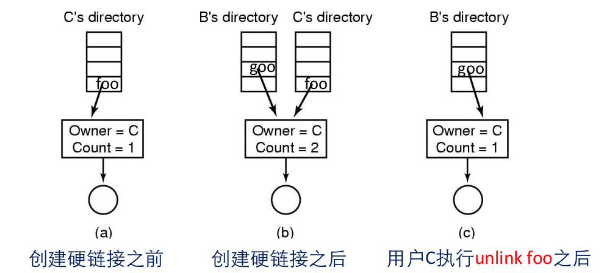

*9.符号链接*

- 硬链接的限制：
  - 不允许对目录做link
  - 不能跨FS做link
- 另一种文件共享的手段：
  - symlink系统调用或`ln -s`命令
  - `ln -s source link_name`

*10.rename*

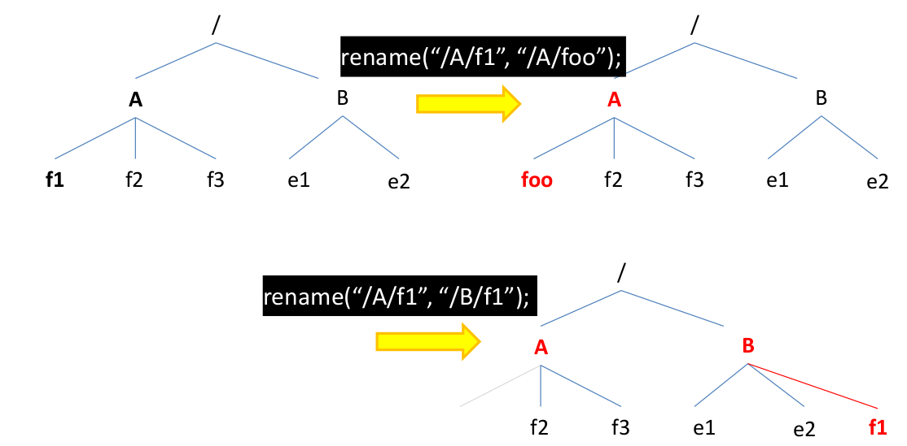

- 只改变文件名字，无数据拷贝
- 保证原子性

*11.文件系统物理结构（磁盘布局）*

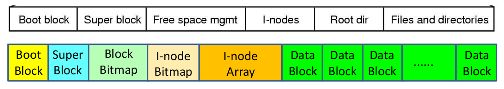

- 引导块：启动OS的代码
- 超级块：定义一个FS及其相关的信息
- 空闲空间管理相关的信息
- i-node表：每个i-node描述一个文件或目录
- 数据块：文件块或目录块

*12.FS相关的接口（系统命令）*

- 创建文件系统：`mkfs`
- 删除文件系统：`rmfs`
- 挂载文件系统：`mount -t fstype dev dir`
- 卸载文件系统：`umount dev|dir`
- 显示已安装FS：`mount`或`mount dev|dir`
- 同步文件系统：`sync`
- 获取文件系统属性：`df`
- ...
- 创建、删除、安装，卸载只允许特权用户调用

*13.虚拟文件系统（VFS）*

- 新需求：多种类型文件系统，同时挂载不同类型的FS
- 面向对象的编程思想：
  - VFS：实现FS接口和通用功能，规定PFS API
  - PFS：磁盘布局、数据结构、磁盘空间管理、名字空间管理...
- 虚拟文件系统开关表：用于文件系统的挂载与卸载
  - 每一种类型的文件系统有一个表项
    - 文件系统类型的名字
    - 初始化函数指针，用于`mount`
    - 清除函数指针，用于`umount`

*14.超级块*

- 定义一个文件系统：
  - 数据块的大小
  - i-node的大小
  - 数据块总数
  - i-node总数
  - 根目录ino
  - i-node表的起始地址
  - 空闲数据块指针
  - 空闲i-node指针
- 当前状态：
  - 数据块使用情况：已使用的块数，预留的块数，剩余的块数...
  - i-node使用情况：已使用的个数，剩余的个数...
- `mkfs`：创建磁盘布局，初始化超级块，bitmap，根i-node等

*15.mount*

- 前提：
  - 文件系统类型必须事先已注册到内核
  - 挂载目录必须已经创建好
- 步骤：
  1. 根据文件系统类型，假设为ext4，查VFS开关表，找到ext4文件系统类型的初始化函数，即`ext4_mount()`
  2. 调用`ext4_mount`：读取超级块，读取根目录i-node
  3. 初始化一些内存数据结构：超级块，根i-node等

*16.i-node*

- ino：i-node number，即i-node的ID
- 文件属性信息：
  - mode：文件类型和访问权限
  - size：文件大小
  - nlinks：硬链接数
  - uid：所有者的user ID
  - gid：所有者的group ID
  - ctime：文件创建的时间戳
  - atime：上一次访问文件的时间戳
  - mtime：上一次修改文件的时间戳
- 文件块的索引信息：文件块的磁盘位置信息，不同FS采用不同的索引机制

*17.目录*

- 目录内容为它所包含的所有子目录和文件的名字及其ino，不包含子目录的内容
- 逻辑上，目录是一张映射表，目录项：文件名 -> ino
- 路径解析：
  - 根据路径名，获得其ino
  - 逐级目录查找

*18.打开文件*

- `fd = open(pname, flags, mode)`
- 打开文件信息表
- Open：通过打开文件描述符把进程与文件的i-node进行关联：
  1. 参数检查
  2. 路径名解析和权限检查，得到pname的ino，读出它的i-node
  3. 将i-node拷贝至一个内存i-node结构中
  4. 创建一个打开文件描述符
  5. 在PCB中分配一个空闲的打开文件指针来指向该打开文件描述符
  6. 返回这个指针的下标，即文件描述符fd

*总结*

- FS名字空间是由目录和文件构成的树形层次化结构
  - 文件是无结构的命名字节数组
  - 目录是文件和子目录的命名集合
  - 文件和目录有各自的访问接口
- FS磁盘布局和主要数据结构：
  - 超级块：定义一个文件系统
  - i-node：定义一个文件/目录，根据ino定位i-node的磁盘位置
  - 目录：一种特殊的文件，文件名 -> ino的映射表

### 文件系统实现

#### 磁盘空间管理

*1.连续分配*

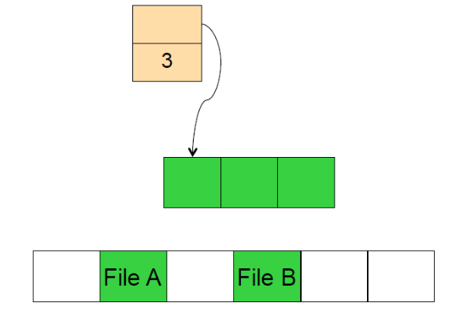

- 分配连续的磁盘块给文件
  - 文件粒度分配
  - 位图：找到N个连续的“0"
  - 链表：找到size>=N的区域
- 文件元数据：记录第一块的地址，以及块的个数N
- 优点：
  - 顺序访问性能高
  - 随机访问时定位数据块也容易
- 缺点：
  - 不知道文件最终多大，无论创建时，还是写数据块时
  - 文件难以变大
  - 外部碎片化

*2.文件块索引：链表结构*

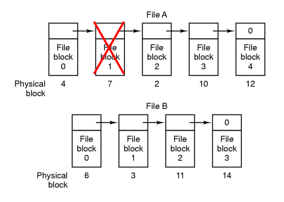

- 分配不连续的磁盘块给文件：块粒度分配
- 文件元数据：
  - 记录第一块的地址
  - 每一块指向下一块的地址
  - 最后一块指向NULL
- 优点：
  - 无外部碎片，而且文件变大很容易
  - 空闲空间链表：与文件块类似
- 缺点：
  - 随机访问性能极差：定位数据块需要按指针顺序遍历链表
  - 可靠性差：一个块坏掉意味着其余的数据全部”丢失“
  - 块内有效数据的大小不再是2的幂次，导致额外的磁盘数据拷贝

*3.文件块索引：文件分配表（FAT）*

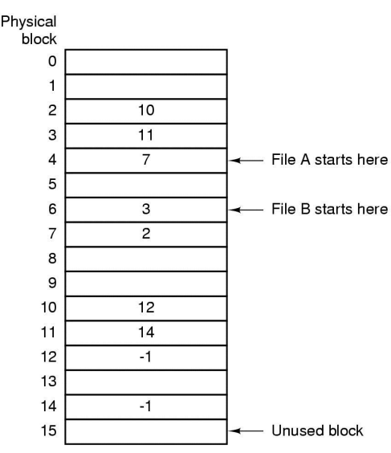

- 一张有N个项的表，假设磁盘有N块
  - 每个磁盘块有一个表项：要么为空，要么为该文件下一块的地址
  - 位于磁盘分区的头部
- 文件元数据：
  - 记录第一块的地址：链表头指针
  - 每个磁盘块全部存数据，无指针
- 优点：
  - 简单
  - 文件块大小为2的幂
- 缺点：
  - 随机访问性能不好：定位数据需要遍历链表
  - 浪费空间：额外的空间存储FAT表

*4.文件块索引：单级索引*

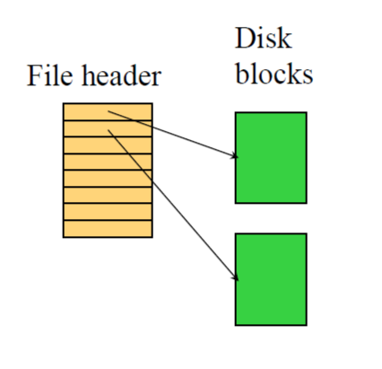

- 文件元数据
  - 用户定义文件长度上限max size
  - file header：一个指针数组，指向每个块的磁盘地址
- 优点：
  - 文件在限制内可变大
  - 随机访问性能高，数据块直接定位
- 缺点：不灵活，文件长度难以事先知道

*5.文件块索引：两级索引*

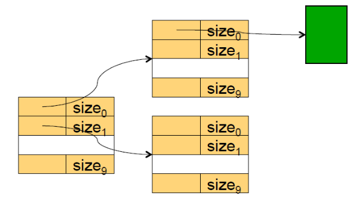

- 思路：
  - 采用连续分配，允许不连续
  - 不定长分配
- 文件元数据：
  - 小文件有10个指针，指向10个可变长度段（base, size）
  - 大文件有10个间接指针，每个指向可变长度的间址块
- 优点：支持文件变大（最大为10GB）
- 缺点：不灵活，外部碎片

*6.文件块索引：多级索引（UNIX）*

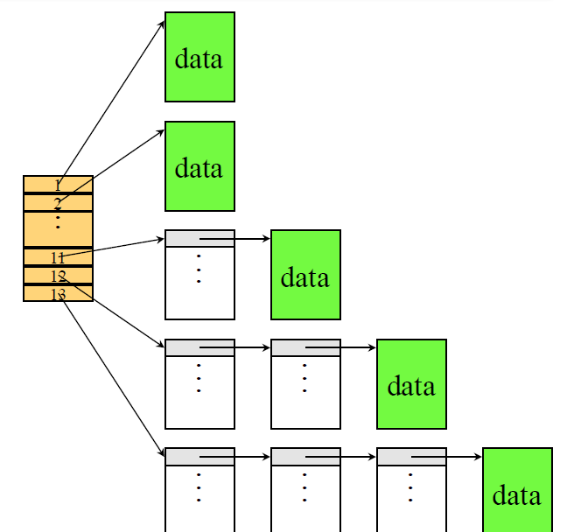

- 块粒度分配
- 文件元数据：13个指针
  - 10个直接指针
  - 11：一级间接指针
  - 12：二级间接指针
  - 13：三级间接指针
- 优点：小文件访问方便，支持文件变大
- 缺点：文件大小有上限（16G多），大量寻道

*7.文件块索引：Extents*

- Extent是若干个连续磁盘块（长度不固定）
  - 同一extent中的所有块：要么都是空闲块，要么都属于某个文件
  - extent：<starting block, length>
- XFS提出的方法：
  - 无论文件块还是空闲块都采用extents来组织
  - 文件块索引采用extent B树
  - 每个extent：
    - 文件块号、长度（块数）、磁盘起始块号
    - 文件元数据：记录B树的根节点地址

*8.名字空间管理*

- FS接口：
  - 目录树：多级目录，文件
  - 用户/进程按路径名访问文件或目录
- 名字空间相关的操作：
  - 目录访问：创建/删除目录，创建/删除文件，链接，重命名，读目录
  - 路径名解析
- FS内部：
  - 根据ino定位i-node的磁盘位置
  - 根据i-node定位文件块的磁盘位置（文件块索引）
  - 文件名与i-node分离存储
  - 文件名保存在目录内容中：目录项为<fname, ino>

*9.创建文件或目录*

- 例：创建文件”/home/example/os/fs\_lecture.pdf"

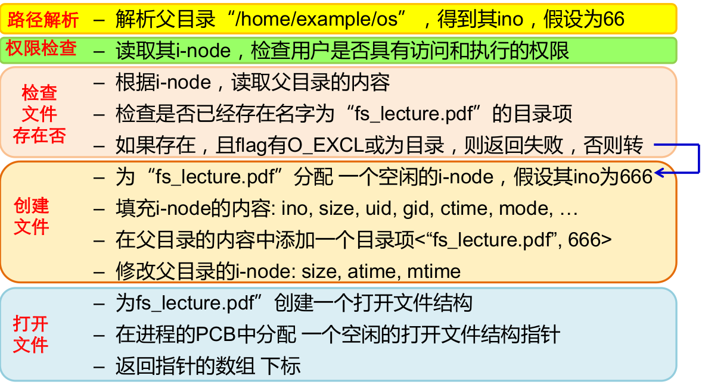

*10.删除文件或目录*

- 例：删除文件“/home/test/os/fs\_lecture.pdf"

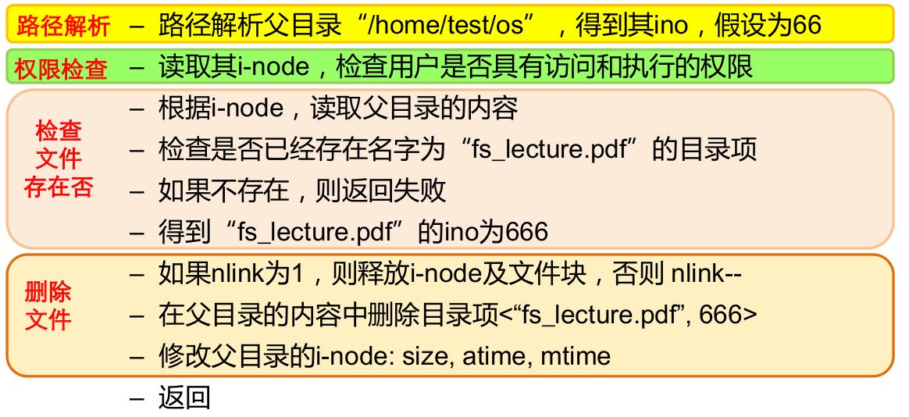

#### 目录实现

*1.线性表*

- 原理：
  - <文件名，ino>线性存储
    - 每一项不定长：<ino，名字长度，下一项起始偏移，名字>
  - 创建文件：
    - 先查看是否有重名文件
    - 如果没有，在表末添加一个entry：<newfile, ino>
  - 删除文件：
    - 用文件名查找
    - 删除匹配的entry
    - 紧缩：将之后的entry都向前移动
- 优点：空间利用率高
- 缺点：
  - 大目录性能差：线性查找磁盘I/O多
  - 删除时紧缩很费时

*2.B树*

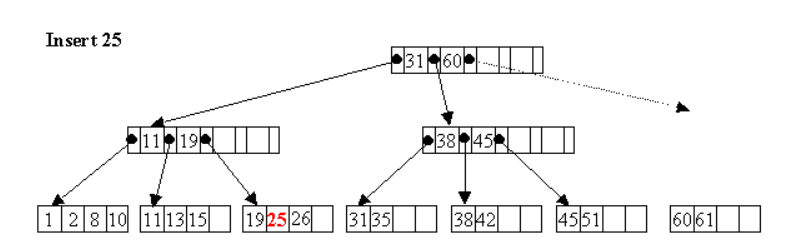

- 原理：
  - 用B树来存储<文件名，ino>，以文件名排序（字典序）
  - 创建/删除/查找：在B树中进行
- 优点：大目录性能高，B树查找减少磁盘I/O
- 缺点：
  - 小目录不高效
  - 占用更多空间
  - 实现复杂

*3.哈希*


- 原理：
  - 用哈希表将文件名映射到ino：
    - hash\_func(filename) -> hval -> bucket
    - 在bucket中线性查找文件名
  - 文件名是变长的
  - 创建/删除需要分配/回收空间
- 优点：简单，查找速度快
- 缺点：对于很大的目录，效率不如B树；哈希表浪费空间

*4.虚拟页表 VS 文件块索引*

- 页表：
  - 维护进程地址空间与物理内存地址空间的映射关系
  - 虚页号 -> 物理页号
  - 检查访问权限，地址合法性
  - 如果映射关系在TLB中，一个cycle就完成转换
- 文件块索引：
  - 维护文件块与磁盘逻辑块之间的映射关系
  - 文件和文件内偏移 -> 磁盘逻辑块号
  - 检查访问权限，地址合法性
  - 由软件（OS）实现，可能引入多次I/O

*4.文件系统 VS 虚存*

- 相似点：
  - 位置透明性：用户不感知物理地址
  - 固定粒度分配：块/页
  - 保护：读/写/执行权限
- FS比VM容易的地方：
  - FS的映射可以慢
  - 文件比较稠密，经常是顺序访问
  - 页表处理的进程地址空间非常稀疏，通常是随机访问
- FS比VM难的地方：
  - 每层路径解析都可能引入I/O
  - 文件缓存的空间（内存）总是不够的
  - 文件长度差距大：很多不足10KB，有的又大于GB
  - FS的实现必须是可靠的

*5.最初的UNIX FS*

- 简单的磁盘布局：
  - 文件块大小 = 扇区大小（512B)
  - i-node区在前，数据区在后
  - 空闲块/i-node链表：Super Block中记录头指针
- 文件块索引采用三级间址，目录采用线性表
- 存在的问题：带宽很低，文件个数有上限

*导致带宽低的原因*

- 数据块的存储位置：数据块存储在内存的柱面，i-node存储在外层的柱面
- 经常要长距离寻道：
  - i-node与其数据块离得很远
  - 同一目录里的文件，其i-node也离得很远
  - 一个文件的数据块散布在磁盘上的任意位置
- 未考虑给文件分配连续磁盘块：
  - 空闲块采用链表组织
  - 链表上相邻的块其物理地址不连续
  - 磁盘空间碎片：一个文件的数据块散布在磁盘上的任意位置
  - 磁盘碎片整理工具：拷贝数据块&修改i-node

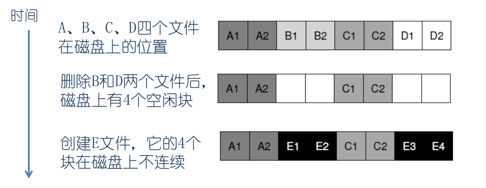

- 小粒度访问多：采用512B的块
  - 有利于减少块内碎片：小文件不足一个块，最后一个数据块通常不满
  - 无法发挥磁盘带宽：块越大，带宽越高
  - 文件块索引大，索引开销高

*6.BSD FFS（Fast File System）*

- 大文件块：4KB或8KB
  - 数据块大小记录在超级块中
  - 空间利用率问题：小文件，大文件的最后一块可能非常小
    - FFS的解决办法：数据块划分为若干更小的子块（分片），子块为512B
- 位图（BM）：取代空闲块链表
  - 尽量连续分配
  - 预留10%的磁盘空间

*FFS的磁盘布局*

- 柱面组（CG, Cylinder Group）
  - 每N个连续的柱面为一个CG
  - 把磁盘划分为若干个柱面组，将文件和目录分散存储于每个柱面组
  - 每个CG类似一个sub FS

*FFS的放置策略*

- 减少长距离寻道：把相关的东西放在同一CG
- 目录放置：
  - 选择CG：目录个数少，空闲i-node个数多，空闲块多
  - 所有的目录尽可能均衡分布在所有CG上
- 文件放置：
  - 文件块选择其i-node所在的CG
  - 同一目录下的文件选择目录所在的CG

*FFS的其他优化*

- 大文件：
  - 避免占满一个CG
  - i-node所在CG：前10块（直接指针指向）
  - 每个间址块及其指向的块在同一CG
  - 不同间址块及其指向的块在不同CG
- 顺序访问性能：
  - 一块一块的顺序读写，避免额外的旋转延迟
  - FFS：逻辑块到物理块的映射采用间隔方式

### 文件系统可靠性

#### 文件缓存

*1.路径名解析*

例子：在UNIX中查找/usr/ast/mbox

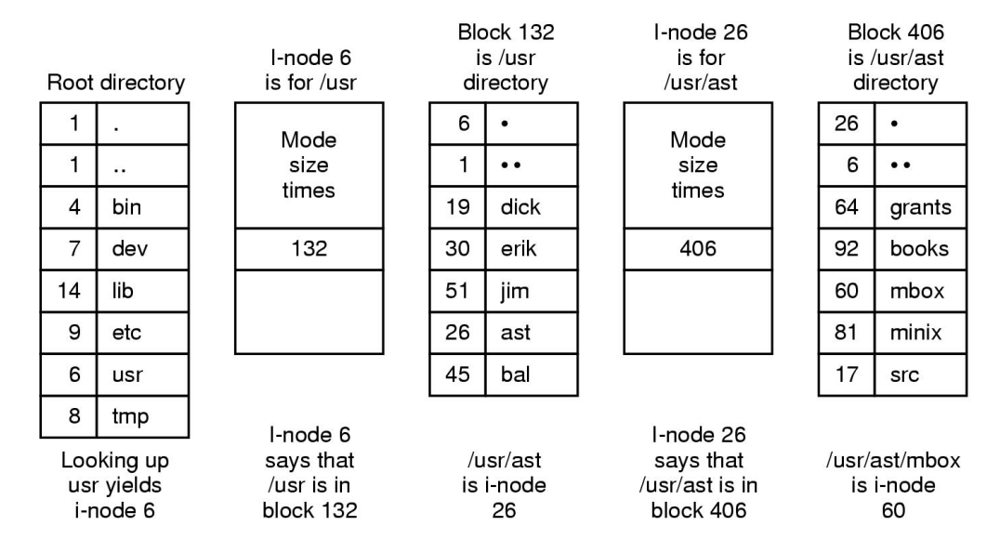

*I/O性能*

- 读一个文件：/home/example/foo，假设读它的第一块：


- 写一个新文件：/home/example/goo，假设只写入一个块：

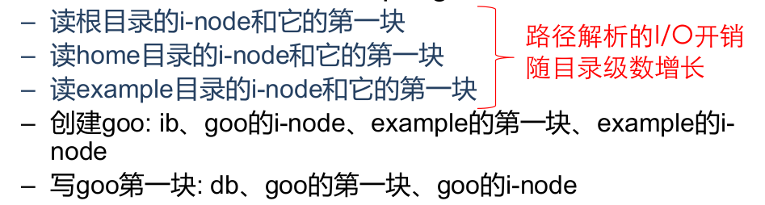

*2.文件缓存*

- 使用内核空间的一部分内存来缓存磁盘块
- 读操作：先检查该块是否在缓存中
  - 在：将缓存块的内容拷贝到用户buffer中
  - 不在：分配一个缓存块（可能需要替换），把磁盘块读到缓存，再把缓存块拷贝到用户buffer
- 写操作：先检查该块是否在缓存中
  - 在：将用户buffer的内容拷贝到缓存块中
  - 不在：分配一个缓存块（可能需要替换），将用户buffer的内容拷贝到缓存块中
  - 将该缓存块写回磁盘（根据缓存管理策略）
- 缓存设计问题：
  - 缓存什么
  - 缓存大小
  - 何时放进缓存
  - 怎么替换，替换谁
  - 写回策略

*缓存大小*

- 文件缓存与VM竞争有限的内存空间
- 两种方法：固定大小 & 可变大小
- 如何调整缓存大小：
  - 由用户决定
  - 工作集思想：在不超过阀值时动态调整

*为什么缓存位于内核空间*

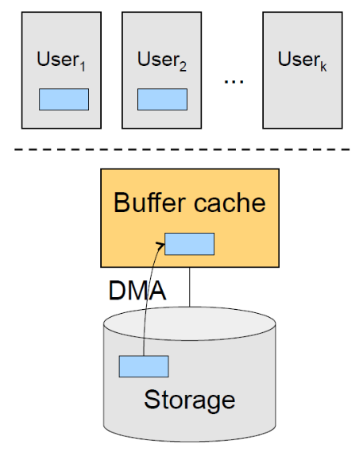

- DMA：DMA需要绑定物理内存
- 多用户进程：共享缓存
- 经典的替换策略：全局LRU

*3.预取*

- 文件访问具有局部性：
  - 空间局部性
  - 时间局部性
- 最优：在要用之前刚好预取进来
- 通常的策略：
  - 针对顺序访问的预取：访问第i块时，预取随后的k个块
    - 指针文件块分配连续的磁盘块
    - Linux采用此方法
  - 针对i-node的预取：在读取目录项时，同时读取对应的i-nodes
- 高级策略：预取同一目录下的所有小文件

*4.替换策略*

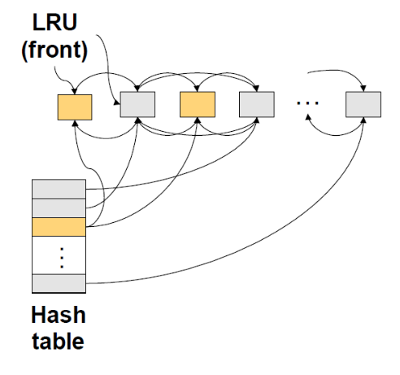

- 原理：用过去预测未来，LRU效果好
- LRU策略：
  - 哈希表 + 双向链表：MRU端为链头，LRU端为链尾
  - 如果b在缓存，则将它移到链头，返回b
  - 否则，替换链尾的块，从磁盘读取b，将它插入链头

*5.写回策略*

- 写与读是不同的：数据必须写到磁盘才能持久化
- Write through：
  - 每个写操作，不仅更新缓存块，而且立即更新磁盘块
  - 缓存内容与磁盘块内容是一致的
  - 简单，但是磁盘写没有减少
- Write back：
  - 写缓冲：每个写操作只更新缓存块，并将其标记为“dirty”
  - 之后再将它写到磁盘
  - 写操作块，减少磁盘写：缓存吸纳多次写，批量写磁盘

*写回的复杂性*

- 丢数据：
  - 宕机时，缓存中的“脏”数据将全部丢失
  - 推迟写磁盘：更好的性能，但损失更大
- 什么时候写回：
  - 当一个块被替换出缓存时
  - 当文件关闭时
  - 当进程调用`fsync`时
  - 固定的时间间隔（UNIX是30秒）
- 问题：
  - 执行写操作的进程并不知道数据什么时候落盘了
    - `fsync`：让用户控制写回数据
    - direct I/O：不使用缓存
  - 上述策略都不足以保证不丢数据：宕机或掉电可能发生在任何时候

#### 文件系统可靠性

*1.威胁FS的因素*

- 设备坏
  - 磁盘损坏或磁盘块损坏
  - 超级块：整个FS丢失
  - 位图块，i-node
  - 数据块：目录、文件、间址块损坏
- 宕机或掉电：
  - 软件bug
  - 缓存中的“脏”数据没有写回磁盘

*2.备份与恢复工具*

- 物理备份与恢复：设备级，将磁盘块逐一拷贝到另一个磁盘上（备份盘）
  - 全复制：原始盘与备份盘在物理上一模一样
  - 增量肤质：与上次备份相比，只拷贝发生变化的块
- 逻辑备份与恢复：文件系统级
  - 遍历文件系统目录树，从根目录开始
  - 把你指定的目录和文件拷贝到备份磁盘
  - 在备份过程中验证文件系统结构
  - 恢复工具：将你指定的文件或目录树恢复出来
  - 也有两种：
    - 全备份：备份整个目录树
    - 增量备份：只备份发生变化的目录和文件

*3.持久化与宕机*

- 文件系统给用户提供持久化的数据存储
  - 文件一直要保存完好，除非用户显示删除它们
  - 如果有备份，可以恢复出已经删除的文件
- 为什么难：
  - 机器可能在任意时刻宕机
  - 宕机使得内存中的数据全部丢失
  - 一个写操作往往修改多个块，但系统只能保证原子修改一个块

*4.宕机破坏文件系统的一致性*

- 例：在当前目录/home/test下创建文件testfile


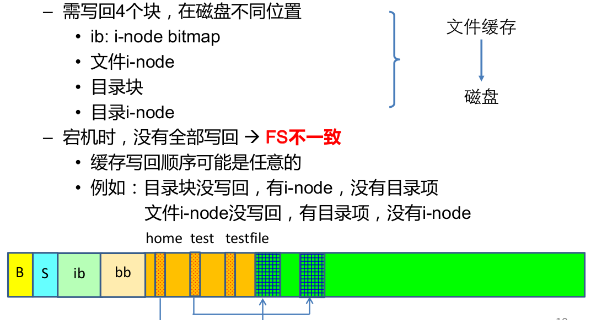

- 例：在文件/home/test/testfile/文件末尾写入一个数据块

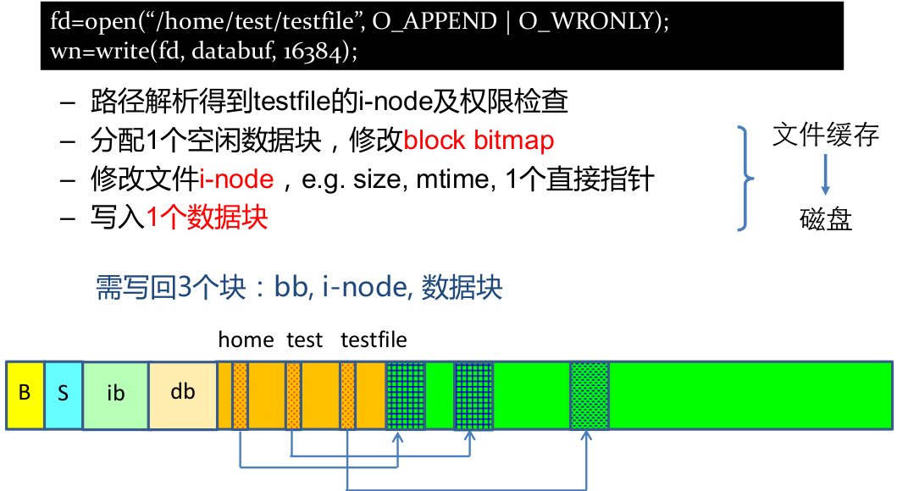

*先写元数据、后写数据*

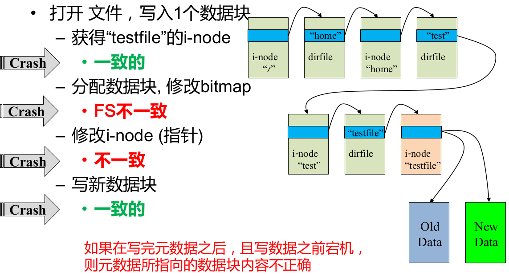

*先写数据、后写元数据*


*5.保证一致性的修改*

- 通用方法：按自底向上顺序进行修改
  - 文件数据块 -> 文件的i-node -> 目录文件 -> 目录i-node...
- 如果有文件缓存：
  - 写回所有的数据块
  - 修改文件的i-node，并把它写回磁盘
  - 修改目录项，并把它写回磁盘
  - 修改目录的i-node，并把它写回磁盘
  - 沿路径向上，直到无修改的目录
- 缺点：
  - 写性能差：对于磁盘是串行的小粒度随机写，写性能差
  - FS不一致：宕机后可能产生垃圾块

*7.`fsck`：UNIX FS一致性检查工具*

- 检查并试图恢复FS的一致性：不能解决所有问题，比如数据与元数据不一致
- 检查superblock：如果fs size < 已分配块，认为它损坏，切换到另一个副本
- 检查块位图
  - 重构已使用块信息：扫描磁盘上所有的i-node和间址块
  - 重构已使用i-node信息：扫扫描磁盘上所有目录的目录项
- 检查i-node
  - 通过type域的值来判断i-node是否已经损坏
  - 如果损坏，则清除该i-node及它对应的位图位
- 检查nlink域
  - 遍历FS的整个目录树，重新计算每个文件的链接数
  - 没有目录项指向的i-node，放到lost+found目录下
- 检查数据块是否冲突
  - 是否有两个或更多的i-node指向同一个数据块
  - 把这个数据块的内容复制一遍
- 检查数据块指针：是否指针越界
- 缺点：恢复时间与FS大小成正比，即使只损坏了几个块，需要扫描整个磁盘和遍历FS目录树

*8.恢复磁盘块结构*

- 启动块：
  - 创建一个替代启动块的工具
  - 复制一份启动块以及内核到U盘
- 超级块：复制多个副本
- 空闲块结构：
  - 从根目录开始，遍历目录树，得到所有可达文件
  - 不可达的块都为空闲块

*9.事务概念*

- 事务概念来自于数据库
- 事务是一组操作，具有“ACID”性质：
  - Atomicity：原子性，要么所有操作都成功完成，要么一个操作也不曾执行过
  - Consistency：一致性，事务完成后，所有状态必须是正确的
  - Isolation：隔离性
    - 事务的中间状态对其他事务不可见
    - 针对并发执行事务，并发执行的结果等同于顺序执行的结果
  - Durability：持久性
    - 一旦一个事务成功完成，其结果是永久性的
    - 后续事务可基于此结果继续操作

*10.事务操作接口*

- 定义构成事务的一组操作
- 原语：
  - Begin Transaction：标记一个事务的开始
  - Commit（End Transaction）：标记一个事务的成功
  - Rollback：回滚，撤销从"Begin Transaction"起发生的所有操作
- 规则：
  - 事务可以并发执行
  - 回滚可以在任意时刻执行
  - 事务可以嵌套

*11.事务的实现：Write-Ahead Log*

- Begin Transaction：在磁盘上记录一条开始日志TxB，标明一个事务开始
- 事务中的修改：
  - 所有修改都记录日志
  - 事务日志中需要标明事务编号TID
- Commit：在磁盘上写一条结束日志TxE，标明一个事务成功完成
- Checkpoint：Commit之后，把该事务中的修改全部写到磁盘上
- 清除日志：Checkpoint写完后，清除相应的日志
- 宕机恢复：replay
  - 如果磁盘上没有结束日志TxE，什么也不做
  - 如果有，按日志重做，然后清除日志
- 前提假设：
  - 写到磁盘上的日志和数据都是正确的（错误发现和纠错机制）
  - 宕机后磁盘仍然是好的
  - 日志中记录的所有修改必须是幂等的
  - 每个事务有唯一的编号TID
  - 必须有办法确认写磁盘完成

*12.将事务用于FS*

- 日志文件系统（Logging File System）
  - 用事务来实现一致性的修改
  - 每个文件操作都作为一个事务：创建/删除文件/目录，重命名，硬链接，软连接，写文件...
- 宕机恢复：
  - 按日志重做一遍
  - 简单、高效：恢复时间与日志大小成正比
  - 日志必须是幂等的

*日志文件系统：data journaling*

- 记录所有修改的日志
- 例：在一个文件末尾追加一个数据块

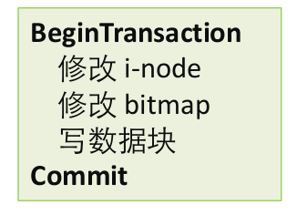

- 流程：
  - 写日志：TxB，i-node日志，bitmap日志，数据块日志
  - 提交日志Commit：写TxE
  - Checkpoint：修改磁盘上的i-node、bitmap、数据块
  - 清除日志
- 日志开销：所有数据块写两次磁盘

*日志文件系统：metadata journaling*

- 只记录元数据修改的日志
- 例：在一个文件末尾追加一个数据块

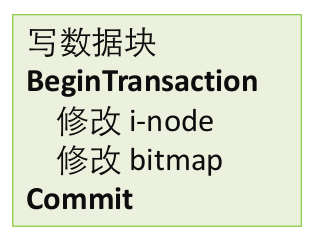

- 流程：
  - 写数据块
  - 写日志：TxB，i-node日志，bitmap日志
  - 提交日志Commit：写TxE
  - Checkpoint：修改磁盘上的i-node，bitmap
  - 清除日志

- 日志开销：所有数据块只写一次磁盘

*13.日志的性能问题*

- 性能问题
  - 频繁写磁盘：每个操作都要同步写磁盘
  - 写放大：只修改一个块中少量内容
- 改进办法
  - 批量提交：以牺牲可靠性换取性能
    - 先修改内存中的数据结构（bitmap，i-node，数据块）
    - 日志记录它们的内存地址
    - 定期提交所有操作的日志
  - 用NVRAM来保存日志
    - MVRAM速度快，写日志快，可以大幅度提高写的IOPS
    - 不丢数据
- 可靠性
  - （批量提交）宕机仍然可能丢数据，但不会破坏文件系统结构
  - 无法应对硬件故障，比如磁盘扇区坏

*14.日志管理*

需要多大的日志？

- 日志只在宕机恢复时需要
- 方法：
  - 定期做checkpoint：把缓存里的内容刷回磁盘
  - checkpoint之后，可以截断日志，从头开始写
  - 固定大小，循环使用
  - 日志要足够大以足以容纳所有内存中的修改
- 实际系统：
  - 日志大小可配置，通常为百MB
  - 位于FS内部，一个特殊文件，文件名&i-node
  - 位于FS外部，专门的日志盘/分区

### LFS（Log-Structured File System）

*1.LFS*

- 目标：提高写性能

- 思想：试图消除对磁盘的小粒度随机写和同步写，像写日志那样大粒度顺序写磁盘
- 具体：
  - 每次写文件写到新位置（日志末尾）：out-of-place update（COW）
  - 不需要bitmap来管理空闲空间
  - 文件块采用多级索引：文件块位置记录在i-node中
  - 每次写文件采用一致性修改：先写文件块，再写i-node

*大粒度顺序写*

- Segment：大粒度的内存buffer
  - 缓存多个写，一次把整个segment写到磁盘

*i-node*

- 每次写文件块，都要写i-node
- 每次写到新位置
- 一个文件的i-node在磁盘上没有固定位置

*imap*

- imap块随文件块和i-node一起写到日志中
- CR（Checkpoint Region）记录每个imap块的最新磁盘位置
- CP位于磁盘上的固定位置，有两个CR，分别在磁盘头和尾

*目录*

- 目录采用与文件一样的方式来写

*读文件*

假设LFS刚挂载，内存里什么都没有

- 先读CR，把CR缓存在内存，以后就不用读了
- 根据ino，知道它所在的imap块
- 查CR，得到imap块所在的磁盘地址
- 读imap块，得到ino对应的i-node的磁盘地址
- 读i-node，查文件块索引，得到文件块的磁盘地址
- 读文件块

重写（修改）会产生垃圾

*修改文件*

- 例：修改/home/test/foo的第一块

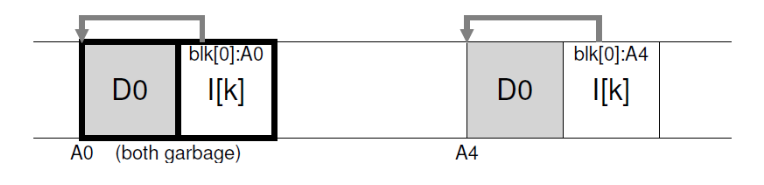

- 原来的数据块变为无效 -> 垃圾
- 例：在/home/test/foo末尾追加写一块

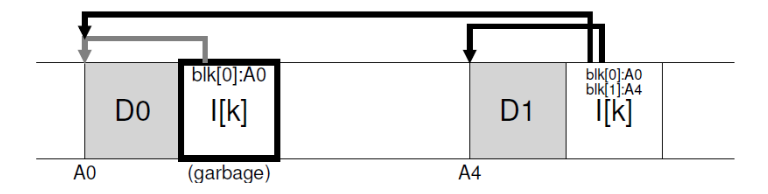

- 原来的i-node变为无效 -> 垃圾

*垃圾回收*

- 原理：
  - 后台进程cleaner周期性的检查一定数量的segment
  - 把每个segment中的活块拷贝到新的segment中
- 何时回收：
  - 周期性回收
  - 空闲时：无访问或访问少
  - 磁盘满时
- 回收什么样的segment：
  - 热segment：块频繁被重写
  - 冷segment：部分死块，部分稳定块
  - 优先回收冷segment，推迟回收热segment

*宕机恢复*

- 两个CR交替写
- CR的完整性：CR的第一块和最后一块都有一个时间戳
- 恢复：
  - 最后一次完成的Checkpoint：时间戳最新的&完整的CR
  - 重构最新的修改：根据CR找到日志末尾，检查后续写的segment
- 恢复快：无需`fsck`，无需扫描磁盘

### 分布式文件系统和数据保护

#### NFS

*1.NFS（Network File System）*

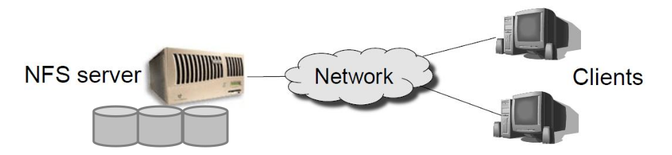

- 多个客户端（计算机）共享一台文件服务器

*2.NFS架构*

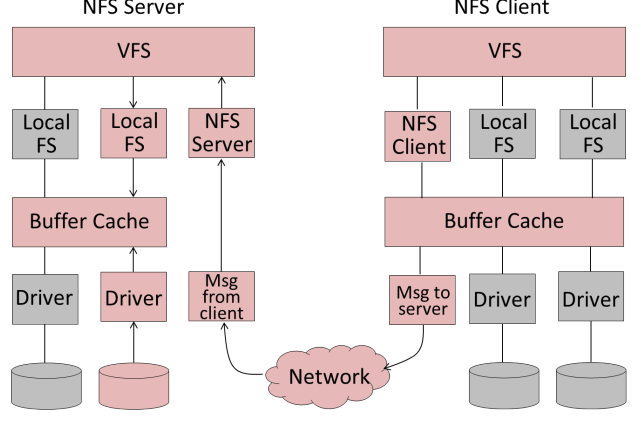

多Client，单Server

- NFS客户端：实现FS功能和接口
  - 接口：syscall，与本地FS相同接口（透明性）
  - 把文件访问syscall转换成请求
  - 把请求发给服务器
  - 接收服务器发回的请求，并返回给调用者
- NFS服务器：
  - 接收客户请求
  - 读写本地FS
  - 把结果发回给客户端
- 缓存：
  - 客户端缓存
  - 服务器端缓存

*3.NFS设计*

- 设计目标：
  - 简单
  - 快速恢复
- 核心思想：无状态服务器
  - 服务器不记录客户端打开的文件
  - 服务器不记录每个打开文件的当前偏移
  - 服务器不记录被客户端缓存的数据块
- 核心数据结构：File Handle（FH）
  - 唯一标识客户端要访问的文件或目录
  - Volume ID
  - ino
  - Generation Number

*4.NFS挂载*

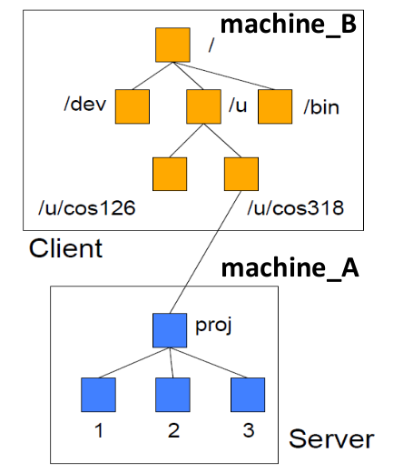

- NFS服务器“export”一个目录给客户端
  - 输出目录表：/etc/exports
  - 输出目录命名：exportfs
- NFS客户端挂载：
  - NFS服务器（机器名或网络地址）
  - NFS服务器输出目录的路径名
  - 服务器返回输出目录的File Handle

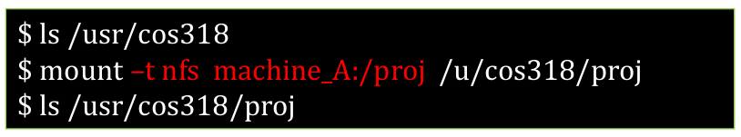

- 自动挂载
- 例：两个客户端挂载同一个服务器输出的目录，挂载之后，三个机器可以共享文件


*5.NFS Protocol*

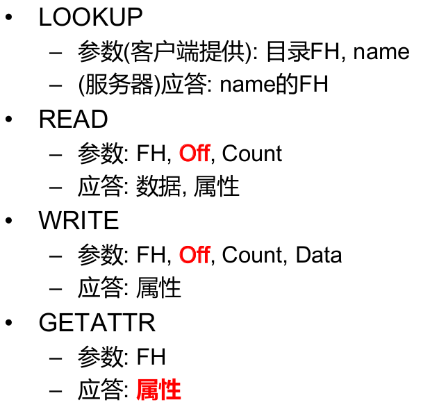

*6.文件访问的实现*

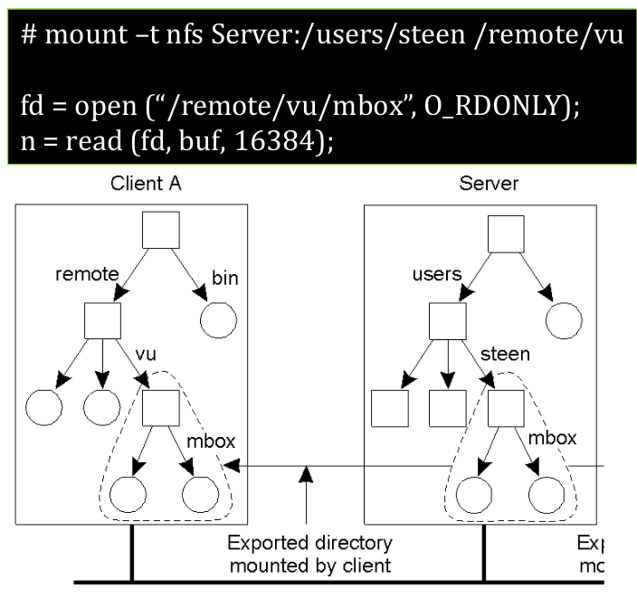

- 客户端open一个文件
  - open() syscall：路径解析
  - 向服务器发LOOKUP请求
  - 接收服务器应答的FH
  - 将本地fd与FH关联
  - fd的偏移置为0
- 客户端read文件
  - read() syscall：fd, buf, count
  - 根据fd得打FH和偏移
  - 向服务器发READ请求
  - 参数为FH，偏移，count
  - 接收服务器的应答数据
  - 把应答数据拷贝到buf
  - fd的偏移 += count
- 客户端close文件
  - 释放fd和打开文件结构
  - 无需与服务器交互
- 服务器接收LOOKUP请求
  - 从目录FH中得到VID和目录ino
  - 读目录i-node
  - 读目录块，查找与name匹配的目录项<name, ino>
  - 构造FH：VID，name的ino，gno
  - 发应答：name的FH
- 服务器接收READ请求
  - 从FH中得到VID和文件ino
  - 打开本地文件ino得到sfd
  - 设置本地文件的偏移（lseek）
  - 读本地文件数据到sbuf中：`read(sfd, sbuf, count)`
  - 关闭本地文件：`close(sfd)`
  - 发应答：sbuf的数据

*7.NFS的失效处理*

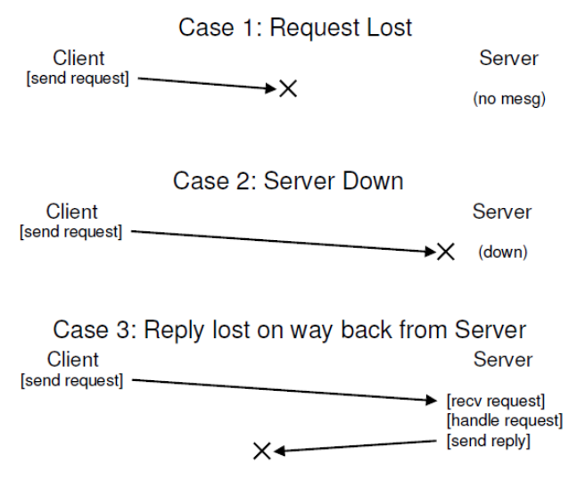

- 三种失效
  - 客户端请求丢失
  - 服务器宕机
  - 服务器应答丢失
- NFS的策略：retry，客户端会超时重发请求
- 前提：协议请求是幂等的

*8.客户端缓存*

- 客户端用一部分kernel内存来缓存元数据和数据
- 好处：提高文件读写性能，减少和服务器的交互
- 缓存一致性问题：
  - 当多个客户端同时读写同一个文件：多读单写、多写
  - 当某个客户端写，导致：
    1. 修改不可见：客户端打开文件读到旧版本（服务器不是最新版本）
    2. 陈旧数据：客户端缓存中的数据变旧
  - NFS解决办法：
    - Close-to-open consistency
      - flush-on-close
      - open时用GETATTR来检查缓存中数据块的有效性
    - 数据块60s过期，属性缓存3s过期
    - 脏数据：30之内写回NFS服务器
  - 附加手段
    - 网络锁管理：顺序一致性
    - 不共享缓存：只能被一个客户端缓存

*9.服务器端缓存*

- 服务器用一部分kernel内存来缓存数据和元数据
- 好处：提高文件读写性能，服务器端减少磁盘I/O
- 问题：服务器宕机可能丢数据
- 解决办法：COMMIT
  - 服务器把之前WRITE写在缓存中的数据写到持久化存储
  - 参数：FH，偏移，count
  - 如果COMMIT超时未收到应答：之前的WRITE和COMMIT本身都要重发

*10.NFS的影响力：企业级存储*

- 企业数据中心：SAN架构

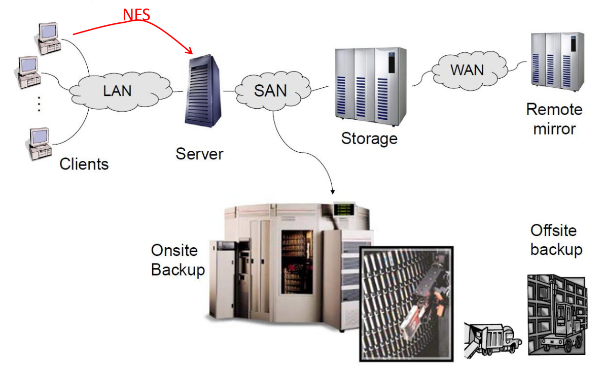

- 企业数据中心：NAS架构（快照）

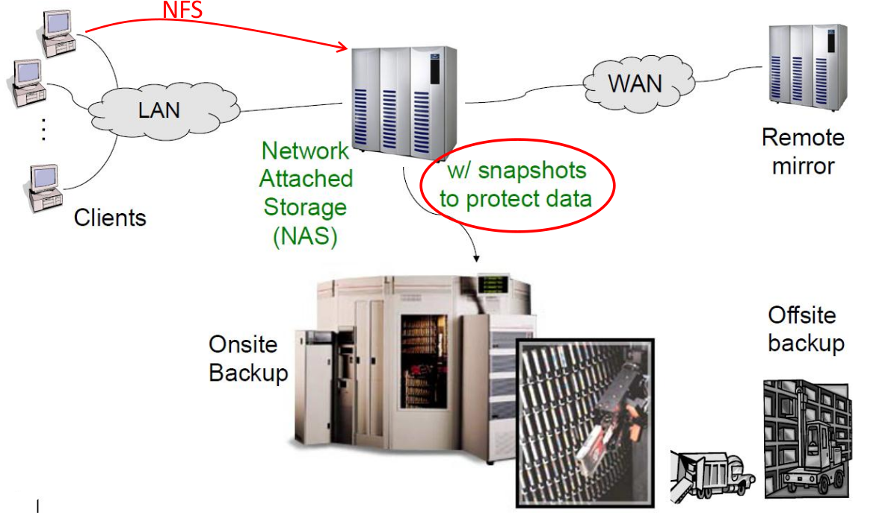

#### WAFL

*1.NetApp的NFS文件服务器*

- WAFL：Write Anywhere File Layout
  - NetApp为其NFS产品设计的文件系统
- 设计目标：
  - 请求服务速度快：吞吐率更多，I/O带宽更高
  - 支持大文件系统，且文件系统不断增长
  - 高性能软件RAID
  - 宕机后快速恢复
- 独特之处：
  - 引入快照
  - 使用NVRAM记录日志（写前日志）
  - 磁盘布局受LFS启发

*2.快照（snapshot）*

- 快照是文件系统的一个只读版本
  - 1993年提出
  - 成为文件服务器必备特性
- 快照用法：
  - 系统管理员配置快照的个数和频率
  - 最初系统能支持20个快照
  - 用快照恢复其中任何一个文件

*3.i-node、间址块和数据块*

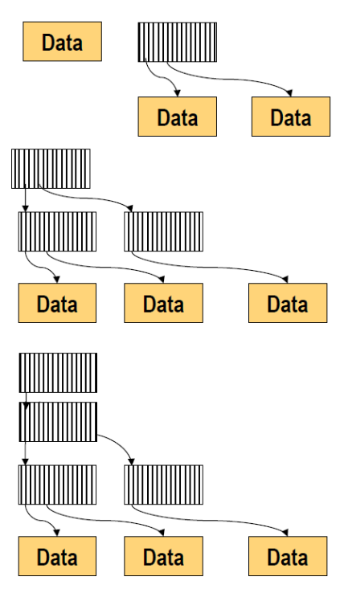

- WAFL使用4KB
  - i-node：借鉴UNIX FS
  - 16个指针（64B）用于文件索引
- 文件大小$\le 64B$：文件直接存储在i-node中
- 文件大小$\le 64KB$：i-node存储16个指向数据块的指针
- 文件大小$\le 64MB$：
  - i-node存储16个指向间址块的指针
  - 每个间址块存储1024个指向数据块的指针
- 文件大小$> 64MB$：i-node存储16个指向二级间址块的指针

*4.WAFL的磁盘布局*

- 主要数据结构
  - 一个根i-node：整个FS的根
  - 一个i-node file：包含所有i-node
  - 一个block map file：指示所有空闲块
  - 一个i-node map file：指示所有空闲i-node

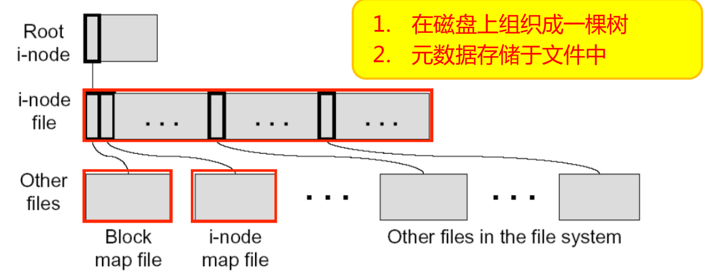

*为什么将元数据存储于文件中*

- 元数据块可以写在磁盘上任何位置：这是WAFL名字的由来
- 使得动态增加文件系统的大小变得容易
  - 增加一个磁盘引发i-node个数的增加
  - 将卷管理集成到WAFL中
- 能够通过Copy-On-Write（COW）来创建快照
  - 新的数据和元数据都可以COW写到磁盘上的新位置
  - 固定元数据位置无法COW

*5.快照的实现*

- WAFL将整个FL组织成一棵树
- 创建快照：
  - 复制根i-node
  - 新的根i-node指向活跃FS
  - 旧的根i-node指向快照
- 创建快照之后：
  - 第一次写一个块：把从它到根的数据块都复制（COW）
  - 活跃FS的根i-node指向新数据块
  - 写数据块
  - 以后对这些数据块的写不再触发COW
- 每个快照都是一个一致状态的只读FS

*6.文件系统一致性*

- 定期创建一致点：特殊的快照，用户不可见
- 宕机恢复：
  - 将文件系统恢复到最后一个一致点
  - 最后一个一致点之后到宕机前的操作：靠日志进行恢复

*7.非易失RAM（Non-Volatile RAM）*

- NVRAM：带电池的DRAM，快，但是电池只能维持几小时~几天
- 日志写入NVRAM
  - 记录自上一个一致点以来的所有写请求
  - 正常关机：先停用NFS服务，再创建一个快照，然后关闭NVRAM
  - 宕机恢复：用NVRAM中的日志来恢复从最后一个一致点之后的修改
- NVRAM划分为两个日志：一个日志写满后，转向写另一个日志，满的日志写回磁盘

*8.快照数据结构*

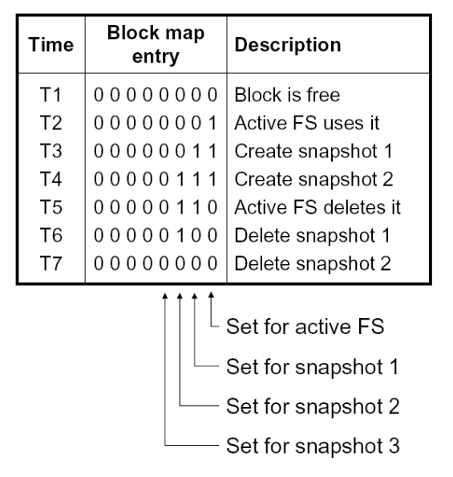

- Block map file
  - 每个4KB磁盘块，对应一个32位的表项
  - 表项值为0：该块为空闲块
  - 第0位等于1：该块属于活动文件系统
  - 第1位等于1：该块属于第一个快照
  - 第2位等于1：该块属于第二个快照
  - ...

*9.快照创建*

- 问题：
  - 正在创建快照时，可能有很多NFS请求到来
  - 文件缓存可能需要写回
  - 不系统NFS长时间被挂起不处理请求
- WAFL的解决方案：
  - 在创建快照前，将块缓存中的脏块标记为“in-snapshot"
  - 所有对”in-snapshot“缓存块的修改请求被挂起
  - 没有标记为”in-snapshot"的缓存数据可以修改，但不能刷回磁盘
- 步骤：
  - 为所有“in-snapshot”的文件分配磁盘空间
    - 将i-node缓存中的脏i-node写回至块缓存
  - 更新block map file：对每个表项，将活动FS位的值拷贝到新快照位
  - 刷回：
    - 把所有“in-snapshot”缓存块写到它们新的磁盘位置
    - 每写回一个块，重启它上面被挂起的NFS请求
    - 复制根i-node

*10.快照删除*

- 删除快照的根i-node
- 清除block map file中的位

#### GFS（Google File System）

*1.GFS：应用需求*

- 大规模集群
- 故障常态化
- GB级大文件的持续高带宽
- 大粒度顺序写和小粒度随机写
- 追加写Append-only：从头写到尾，没有rewrite

*2.GFS：概述*

- 逻辑上，三类组件
  - 客户端提供库函数接口：应用通过专门的库函数访问GFS（用户态）
  - 大量Chunk Server：存储服务器，存储GFS文件
  - 单一Master：存储元数据和维护名字空间
- 物理上，两类机器
  - Master是集群中专门一台机器
  - 集群中其他所有机器，既为客户端，又为Chunk Server
- GFS文件
  - 文件划分为固定长度的Chunk：64MB
  - 以Chunk为粒度存储在多个Chunk Server上
  - 大块的好处：
    - 减少读写时与Master交互
    - 减少元数据量
    - 更好的利用网络和磁盘带宽
  - 文件缓存
    - 客户端不缓存文件：数据量太大
    - 服务器端利用OS提供的文件缓存
- 文件Chunk：每个Chunk保存多个副本
    - 容错：可用性，可靠性
    - 写文件：同时写多分，强一致性
    - 读文件：选择任意一份，比单复本有更高的带宽
    - Chunk多个副本的放置：
      - 本地性：本地放一份
      - 网络距离：同一机架放一份
      - 可用性：不同机架放一份
- GFS Master：集中式管理
    - 维护三类元数据信息：名字空间，文件 -> Chunk映射，Chunk -> CS映射
    - 监测CS的HB，负责故障恢复
    - 所有元数据信息都维护在Master的内存中
    - 元数据定期持久化

*3.GFS：副本一致性*

- Primary Chunk Server
  - 每个chunk有一个主服务器，其他为从服务器
  - 由主服务器确定对chunk的并发写的顺序
- 三阶段写
  1. 与Master交互，获得主服务器位置
  2. 数据传输到主服务器，保存在服务器的内存
  3. 主从服务器把数据写入本地文件

*4.GFS的影像：开源实现HDFS*

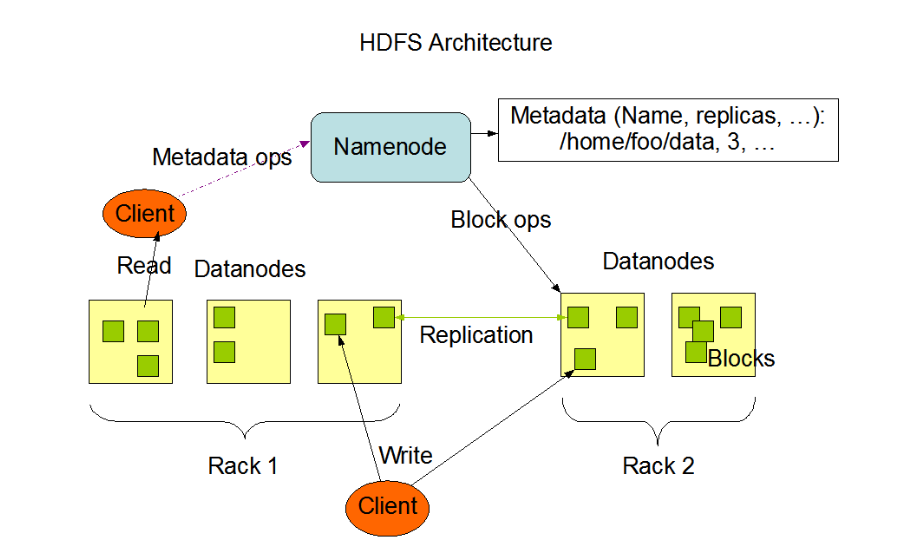

- Hadoop上的分布式文件系统
- 比Hadoop的MapReduce计算平台还要更广泛地使用

*5.GFS的发展*

- 局限性：
  - 集中控制，单一元数据服务器：性能瓶颈、FS规模瓶颈
  - 文件数量越来越多
  - 应用场景越来越多
  - 小文件的应用场景越来越多
- 解决办法：基于分布式大表的元数据管理

*6.分布式文件系统总结*

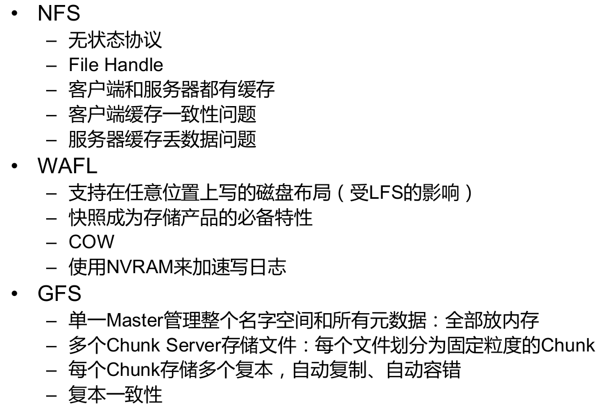

*7.数据保护*

- FS是共享的资源
  - 很多用户
  - 文件或目录：共享或私有
- 访问了不该访问的文件
  - 失误所至
  - 蓄意攻击

*8.安全与保护*

- 不让数据被未经许可的使用
  - 数据机密性：未经许可，不能看到数据
  - 数据完整性：未经许可，不能修改或删除数据
  - 系统可用性：任何人干扰系统使得它不可用
- 90年代之前：PC和网络尚未普及
  - 单位的计算机：多用户共享
  - 任何用户不能读写其他用户的文件
- 互联网时代
  - 数据在网络传输过程中被拦截：数据加密
  - 给一个Internet Server 发送大量的请求

*9.保护：策略与机制*

- 安全策略：定义目标，即要达到的效果，通常是一组规则，定义可接受的行为和不可接受的行为
- 机制：用什么样的方法来达到目标

*10.保护机制*

- Authentication（身份认证）
- Authorization（授权/批准）
  - 决定“A是不是准许做某件事”
  - 需要一个简单的数据库
- 访问控制：
  - 做出“访问是否准许”的规定
  - 确保没有漏洞

*11.身份认证*

- 通常是用密码来验证：一串字符，用户必须记住密码
- 密码以加密形式存储：使用一种单向的安全hash算法
- 缺点：
  - 每个用户都要记很多密码
  - 比较弱：“dictionary attack”

*12.保护域*

- 规则：每个身份准许做哪些事
- 保护矩阵：保护域 VS 保护源

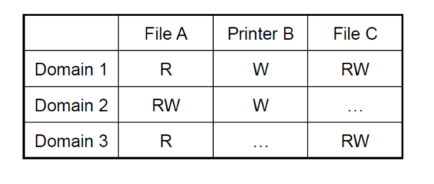

*13.按列：访问控制表（ACL）*

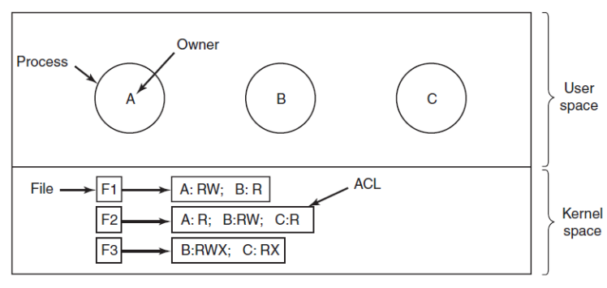

- 每个对象有一个ACL表
  - 定义每个用户的权限
  - 每个表项为<user, privilege>
- 简单，大多数系统都采用，如UNIX的owner, group, other
- 实现
  - ACL实现在内核中
  - 在登录系统时进行身份验证
  - ACL存储在每个文件中或文件元数据中
  - 打开文件时检查ACL

*访问控制*

- 需要一个可信权威：进行访问控制，ACL都需要保护
- 内核是一个可信权威
  - 内核什么事都可以做
  - 如果有bug，整个系统都可能被破坏
  - 它越小、越简单越好
- 安全的强度由保护系统链上最薄弱的环节决定

*14.一些简单的攻击*

- 滥用合法权利
  - UNIX：root能做任何事情
- 拒绝服务（DoS)
  - 耗尽系统所有资源
- 偷听：侦听网络上传输的包

**没有完美保护的系统，每个系统都有漏洞**